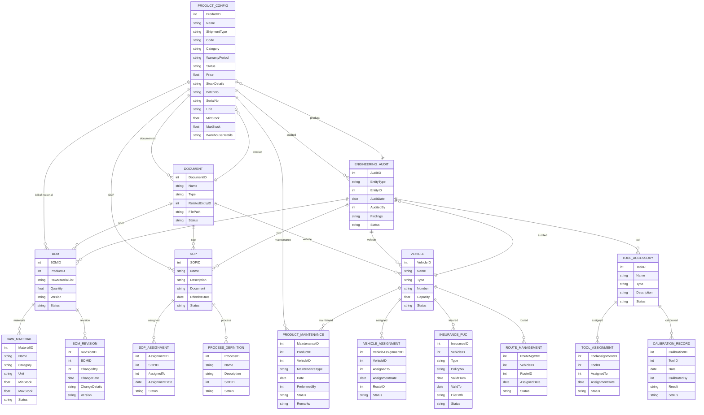

# Module 6: Engineering Management – Entity Design (Based on Module Wise Features.txt SRS)

## 1. Master Entities

| Entity Name         | Description                             | Suggested Fields                                                  |
|---------------------|-----------------------------------------|------------------------------------------------------------------|
| ProductConfig       | Product configuration master            | ProductID, Name, ShipmentType, Code, Category, WarrantyPeriod, Status, Price, StockDetails, BatchNo, SerialNo, Unit, MinStock, MaxStock, WarehouseDetails |
| ProcessDefinition   | Manufacturing process definitions       | ProcessID, Name, Description, SOPID, Status                      |
| SOP                 | Standard Operating Procedures           | SOPID, Name, Description, Document, EffectiveDate, Status        |
| BOM                 | Bill of Material master                 | BOMID, ProductID, RawMaterialList, Quantity, Version, Status     |
| RawMaterial         | Raw material library                    | MaterialID, Name, Category, Unit, MinStock, MaxStock, Status     |
| ToolAccessory       | Tools & accessories                     | ToolID, Name, Type, Description, Status                          |
| Vehicle             | Vehicle master                          | VehicleID, Name, Type, Number, Capacity, Status                  |
| Document            | Engineering documents                   | DocumentID, Name, Type, RelatedEntityID, FilePath, Status        |

## 2. Transaction Entities

| Entity Name         | Description                             | Suggested Fields                                                  |
|---------------------|-----------------------------------------|------------------------------------------------------------------|
| ProductMaintenance  | Maintenance record for product/vehicle  | MaintenanceID, ProductID, VehicleID, MaintenanceType, Date, PerformedBy, Status, Remarks |
| SOPAssignment       | SOP/process assignment                  | AssignmentID, SOPID, AssignedTo, AssignmentDate, Status          |
| BOMRevision         | BOM revision/change history              | RevisionID, BOMID, ChangedBy, ChangeDate, ChangeDetails, Version |
| ToolAssignment      | Tool/Accessory assignment               | ToolAssignmentID, ToolID, AssignedTo, AssignmentDate, Status     |
| VehicleAssignment   | Vehicle assignment                      | VehicleAssignmentID, VehicleID, AssignedTo, AssignmentDate, RouteID, Status |
| InsurancePUC        | Insurance/PUC/Passing details           | InsuranceID, VehicleID, Type, PolicyNo, ValidFrom, ValidTo, FilePath, Status |
| RouteManagement     | Route management for vehicles            | RouteMgmtID, VehicleID, RouteID, AssignedDate, Status            |
| EngineeringAudit    | Engineering audit record                | AuditID, EntityType, EntityID, AuditDate, AuditedBy, Findings, Status |
| CalibrationRecord   | Calibration for instruments/tools        | CalibrationID, ToolID, Date, CalibratedBy, Result, Status        |

## 3. Relations/Dependencies

- **ProductConfig** links to **BOM**, **SOP**, **RawMaterial**, **WarehouseDetails**, **BatchNo**, **SerialNo**
- **ProcessDefinition** references **SOP**
- **BOM** references **ProductConfig**, **RawMaterial**
- **ToolAssignment** and **CalibrationRecord** reference **ToolAccessory**
- **VehicleAssignment**, **RouteManagement**, **InsurancePUC** reference **Vehicle**
- **Document** references any entity via **RelatedEntityID**
- **ProductMaintenance** references **ProductConfig**, **Vehicle**
- **EngineeringAudit** references all core entities

---

## 4. Mermaid ER Diagram

