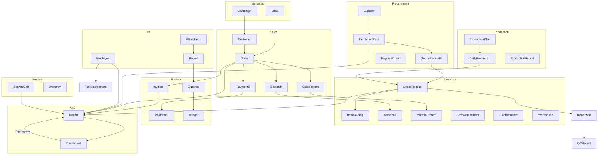

# ERP Entity Data Flow/Dependency Map

## 1. **General Principles**
- **Master Entities** are core, reusable data sets (e.g., Customer, Product, Employee).
- **Transaction Entities** record events, changes, or actions (e.g., Order, Payment, ServiceCall).
- **Data flows** from masters to transactions, and transactions update, trigger, or depend on masters.
- **Cross-module dependencies** allow seamless business processes, e.g., a Sales Order triggers Inventory updates, which then affects Finance.

---

## 2. **Within Module Data Flow**

### Example: **Sales Management**
- **Customer** → **Order** (Customer places Order)
- **Order** → **Payment** (Order generates Payment)
- **Order** → **Dispatch** (Order triggers Dispatch)
- **Order** → **Quotation** (Order may need Quotation)
- **Order** → **SalesReturn** (Order may be returned)
- **Order** → **CreditNote/DebitNote** (Order may cause credit/debit notes)
- **Order** → **CustomerFeedback** (Order triggers feedback)
- **Dispatch** → **Warehouse** (Dispatch affects stock in warehouse)
- **Order** → **Inventory** (Order affects item issue/stock)

### Example: **Procurement Management**
- **Supplier** → **PurchaseOrder** (Supplier receives PO)
- **PurchaseOrder** → **GoodsReceipt** (PO generates GRN)
- **GoodsReceipt** → **Inventory** (GRN updates stock)
- **PurchaseOrder** → **PaymentTrend** (PO triggers payment)
- **Compliance** → **ComplianceCheck** (PO checked for compliance)
- **SupplierEvaluation** → **Supplier** (Evaluation updates supplier status)

---

## 3. **Cross-Module Data Flow/Dependencies**

### **Marketing → Sales**
- **Lead** (Marketing) → **Order** (Sales): Lead conversion drives sales order.
- **Campaign** (Marketing) → **Customer** (Sales): Targeted campaigns affect customer onboarding.

### **Sales → Inventory**
- **Order** (Sales) → **ItemIssue** (Inventory): Order fulfillment reduces stock.
- **SalesReturn** (Sales) → **MaterialReturn** (Inventory): Returns increase stock.

### **Sales → Finance**
- **Order** (Sales) → **Invoice** (Finance): Order generates invoice.
- **Payment** (Sales) → **Payment** (Finance): Payment received updates financial records.

### **Sales → Service**
- **Customer** (Sales) → **ServiceCall** (Service): After-sale service calls use customer data.
- **Warranty** (Service) → **Order** (Sales): Warranty issued based on sales order.

### **Procurement → Inventory**
- **GoodsReceipt** (Procurement) → **GoodsReceipt** (Inventory): GRN updates stock.

### **Production → Inventory**
- **DailyProduction** (Production) → **GoodsReceipt** (Inventory): Finished goods added to stock.
- **ProductionReport** (Production) → **StockAdjustment** (Inventory): Defective goods/damages.

### **Inventory → Quality**
- **GoodsReceipt** (Inventory) → **Inspection** (Quality): Incoming goods inspected.
- **StockReconciliation** (Inventory) → **QCReport** (Quality): Stock audit may trigger QC report.

### **HR → All Modules**
- **Employee** (HR) → **TaskAssignment** (Sales, Service, Production): Employee assigned tasks in multiple modules.
- **Attendance** (HR) → **Payroll** (HR): Attendance drives payroll.

### **Finance → All Modules**
- **Budget** (Finance) → **Department** (HR, Production, Sales): Budgets set for each department.
- **Expense** (Finance) → **Department/Employee**: Expenses claimed by department or employee.

### **MIS Reporting & Dashboard**
- **Report** (MIS) aggregates data from all modules: Sales, Procurement, Inventory, Production, Quality, Finance, HR, Service.

### **Mobile App/Portal/Integration**
- **AppUser/PortalUser** (Mobile/Portal) → **Transaction Entities** (All Modules): Users trigger actions (orders, requests, feedback, approvals).
- **IntegrationLog/DataSync** (Integration) → **ExternalSystem**: Data exchanged between ERP and external apps (CRM, e-commerce, payment gateways).

---

## 4. **Visual Data Flow Example**

---

## 5. **Key Takeaways**
- **Entity data flows** are typically: Master → Transaction → Aggregation/Report → Feedback/Update.
- **Cross-module dependencies** ensure process visibility and automation (e.g., Sales triggers Inventory, Inventory triggers Finance).
- **Integration points** allow data sharing with external systems, mobile apps, and portals.

---

## 6. **How to Use This Map**
- For each process, trace the entity data flow to understand which module and entity need to be updated or referenced.
- Use this map for designing API contracts, integration scenarios, and workflow automation within your ERP.
