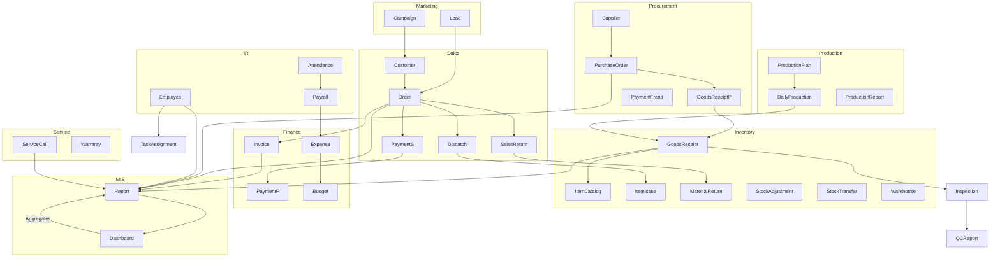

# ERP Entity Data Flow & Dependency Map

## 1. Data Flow Within Modules

### Marketing Management
- `Campaign` → `Lead` (Leads generated via campaigns)
- `LeadAssignment` → `Lead` (Leads assigned/reassigned to agents)
- `Deal` → `Lead` (Leads converted to deals)
- `Quotation` → `Deal` (Deals generate quotations)
- `PerformanceTracking` → `Campaign` (Tracks campaign outcomes)

### Sales Management
- `Customer` → `Order` (Customer places order)
- `Order` → `Dispatch` (Order triggers dispatch)
- `Order` → `Payment` (Order triggers payment)
- `Order` → `SalesReturn` (Order may be returned)
- `Order` → `Quotation` (Order may need quotation)
- `Order` → `CreditNote` / `DebitNote` (Financial adjustments)
- `CustomerFeedback` → `Order` (Feedback after order completion)

### Procurement Management
- `Supplier` → `PurchaseOrder` (Supplier receives PO)
- `PurchaseOrder` → `GoodsReceipt` (PO fulfilled)
- `GoodsReceipt` → `Inventory` (Stock updated)
- `SupplierEvaluation` → `Supplier` (Supplier status updated)

### Inventory Management
- `ItemCatalog` → `GoodsReceipt` (Items received)
- `ItemIssue` → `ItemCatalog` (Items issued for sales/service)
- `MaterialReturn` → `ItemCatalog` (Items returned to stock)
- `StockAdjustment` → `ItemCatalog` (Stock adjusted)
- `StockTransfer` → `Warehouse` (Stock moved between warehouses)

### Production Management/Planning
- `ProductionPlan` → `JobAssignment` (Jobs assigned)
- `JobAssignment` → `MaterialRequest` (Materials requested for jobs)
- `MaterialRequest` → `MaterialReceivedNote` / `MaterialReturn` (Materials received/returned)
- `DailyProduction` → `ProductionReport` (Production reporting)
- `DailyProduction` → `Inventory` (Finished goods added to stock)

### Quality Control Management
- `QualityPlan` → `Inspection` (Quality inspections scheduled)
- `Inspection` → `QCReport` (Inspection results)
- `Rejection` → `Product` (Rejections recorded)

### Finance Management
- `Invoice` → `Payment` (Invoice triggers payment)
- `Expense` → `Budget` (Expense tracked against budget)
- `DebitNote` / `CreditNote` → `Account` (Financial adjustments)
- `TaxCompliance`, `CashFlow`, `Forecast` → `Account` (Finance monitoring)

### HR Management
- `Employee` → `Attendance` / `Leave` / `Payroll` (HR records)
- `Payroll` → `Expense` (Salaries as expense)
- `Evaluation` → `Employee` (Performance appraisals)
- `Task` / `Activity` → `Employee` (Task/activity tracking)

### Service Management
- `Customer` → `ServiceCall` (Service requests after sales)
- `ServiceCall` → `CallAssignment` (Technician assigned)
- `ServiceCall` → `Payment` / `Feedback` (Service payment/feedback)
- `SparePartRequest` / `SparePartIssue` → `Inventory` (Spare parts management)

---

## 2. Cross-Module Data Flow

### Marketing ↔ Sales
- `Lead` (Marketing) → `Order` (Sales): Lead converted to customer order
- `Campaign` → `Customer`: Campaigns target customer onboarding

### Sales ↔ Inventory
- `Order` → `ItemIssue`: Sales order reduces inventory
- `SalesReturn` → `MaterialReturn`: Returns increase stock

### Sales ↔ Finance
- `Order` → `Invoice`: Order generates invoice
- `Payment` (Sales) → `Payment` (Finance): Payment received, financial record updated

### Sales ↔ Service
- `Customer` → `ServiceCall`: Service calls use customer data
- `Warranty` → `Order`: Warranty linked to sales order

### Procurement ↔ Inventory
- `GoodsReceipt` (Procurement) → `GoodsReceipt` (Inventory): Procurement updates stock

### Procurement ↔ Finance
- `PurchaseOrder` → `Invoice`: PO triggers vendor invoice
- `PaymentTrend` → `Payment`: Procurement payment updates finance

### Production ↔ Inventory
- `DailyProduction` → `GoodsReceipt`: Finished goods added to stock
- `ProductionReport` → `StockAdjustment`: Defective/rejected goods tracked

### Inventory ↔ Quality
- `GoodsReceipt` → `Inspection`: Incoming goods inspected
- `StockReconciliation` → `QCReport`: Stock audits trigger QC

### HR ↔ All Modules
- `Employee` assigned to tasks in Sales, Service, Production, etc.
- `Attendance` → `Payroll`: Attendance affects salary

### Finance ↔ All Modules
- `Budget` → `Department` (HR, Production, Sales): Budgets set per department
- `Expense` → `Department` / `Employee`: Expenses claimed

### MIS Reporting & Dashboard
- `Report` aggregates data from Sales, Procurement, Inventory, Production, Quality, Finance, HR, Service

### Mobile App / Portal / Integration
- `AppUser` / `PortalUser` → All Transaction Entities: Users trigger orders, requests, feedback, approvals
- `IntegrationLog` / `DataSync` → `ExternalSystem`: Data exchanged with CRM, e-commerce, payment gateways

---

## 3. Visual Data Flow Example

---

## 4. Notes for Implementation

- **Each transaction entity** should reference master entities for validation and integration.
- **APIs and workflows** should be designed to support these data flows and dependencies.
- **MIS and dashboards** should aggregate and visualize data across modules, supporting decision-making.

---

## 5. Extending This Map

- Specify entity-level links for more granular processes if needed.
- Use this as a blueprint for database schema, workflow engines, and integration middleware.
