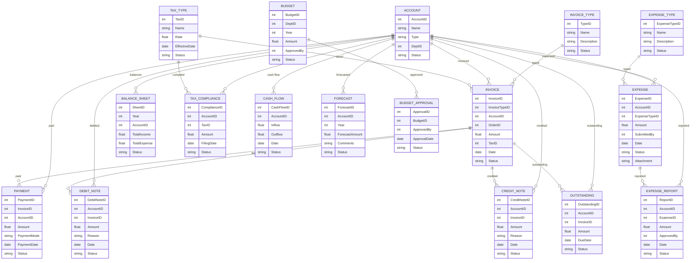

# Module 11: Finance Management – Entity Design (Based on Module Wise Features.txt SRS)

## 1. Master Entities

| Entity Name      | Description                                   | Suggested Fields                                        |
|------------------|-----------------------------------------------|--------------------------------------------------------|
| InvoiceType      | Invoice type master                           | TypeID, Name, Description, Status                      |
| Account          | Account master                                | AccountID, Name, Type, DeptID, Status                  |
| Budget           | Budget master                                 | BudgetID, DeptID, Year, Amount, ApprovedBy, Status     |
| TaxType          | Tax type master (GST, TDS, etc.)              | TaxID, Name, Rate, EffectiveDate, Status               |
| ExpenseType      | Expense type master                           | ExpenseTypeID, Name, Description, Status               |

## 2. Transaction Entities

| Entity Name      | Description                                   | Suggested Fields                                        |
|------------------|-----------------------------------------------|--------------------------------------------------------|
| Invoice          | Sales/service/purchase invoice                | InvoiceID, InvoiceTypeID, AccountID, OrderID, Amount, TaxID, Date, Status |
| Payment          | Payment receipt                                | PaymentID, InvoiceID, AccountID, Amount, PaymentMode, PaymentDate, Status |
| DebitNote        | Debit note                                    | DebitNoteID, AccountID, InvoiceID, Amount, Reason, Date, Status |
| CreditNote       | Credit note                                   | CreditNoteID, AccountID, InvoiceID, Amount, Reason, Date, Status |
| Expense          | Expense record                                | ExpenseID, AccountID, ExpenseTypeID, Amount, SubmittedBy, Date, Status, Attachment |
| BudgetApproval   | Budget approval workflow                      | ApprovalID, BudgetID, ApprovedBy, ApprovalDate, Status |
| BalanceSheet     | Balance sheet record                          | SheetID, Year, AccountID, TotalIncome, TotalExpense, Status |
| TaxCompliance    | Tax compliance record                         | ComplianceID, AccountID, TaxID, Amount, FilingDate, Status |
| CashFlow         | Cash flow management                          | CashFlowID, AccountID, Inflow, Outflow, Date, Status   |
| Forecast         | Financial forecasting                         | ForecastID, AccountID, Year, ForecastAmount, Comments, Status |
| Outstanding      | Outstanding payment tracking                  | OutstandingID, AccountID, InvoiceID, Amount, DueDate, Status |
| ExpenseReport    | Expense reporting                             | ReportID, AccountID, ExpenseID, Amount, ApprovedBy, Date, Status |

## 3. Relations/Dependencies

- **Invoice** references **InvoiceType**, **Account**, **OrderID**, **TaxType**
- **Payment** references **Invoice**, **Account**
- **DebitNote/CreditNote** reference **Account**, **Invoice**
- **Expense** references **Account**, **ExpenseType**
- **BudgetApproval** references **Budget**
- **BalanceSheet** references **Account**
- **TaxCompliance** references **Account**, **TaxType**
- **CashFlow**, **Forecast**, **Outstanding**, **ExpenseReport** reference **Account**

---

## 4. Mermaid ER Diagram

