# Module 12: HR Management – Entity Design (Based on Module Wise Features.txt SRS)

## 1. Master Entities

| Entity Name      | Description                                | Suggested Fields                                        |
|------------------|--------------------------------------------|--------------------------------------------------------|
| Employee         | Employee master                            | EmployeeID, Name, Address, Contact, BirthDate, Gender, MaritalStatus, BankDetails, AdharNo, PanNo, PFNo, UANNo, DeptID, Position, Shift, Status |
| Department       | Department master                          | DeptID, Name, ManagerID, Status                        |
| Position         | Position/Job Role master                   | PositionID, Name, DeptID, Description, Status          |
| PayGroup         | Paygroup master                            | PayGroupID, Name, Description, Status                  |
| LeaveType        | Leave type master                          | LeaveTypeID, Name, Description, Status                 |
| Holiday          | Holiday master                             | HolidayID, Name, Date, Type, Status                    |
| ActivityType     | Activity type master (SMS, Meetings, etc.) | ActivityTypeID, Name, Description, Status              |

## 2. Transaction Entities

| Entity Name      | Description                                | Suggested Fields                                        |
|------------------|--------------------------------------------|--------------------------------------------------------|
| Attendance       | Employee attendance/punch                   | AttendanceID, EmployeeID, ClockIn, ClockOut, Date, RegularisationStatus, Timesheet, CalendarID, Status |
| Leave            | Leave record                                | LeaveID, EmployeeID, LeaveTypeID, StartDate, EndDate, Reason, AlternatePerson, ApprovalStatus, Status |
| Payroll          | Payroll record                              | PayrollID, EmployeeID, PayGroupID, Salary, Incentives, Overtime, Deductions, Month, Year, Status |
| Promotion        | Promotion record                            | PromotionID, EmployeeID, OldPositionID, NewPositionID, EffectiveDate, Benefits, Status |
| SalaryRevision   | Salary revision/increment                   | RevisionID, EmployeeID, OldSalary, NewSalary, AppraisalDate, ApprovedBy, Status |
| Reimbursement    | Reimbursement claim                        | ReimbursementID, EmployeeID, Amount, Reason, ApprovedBy, Date, Status |
| LoanAdvance      | Loan/advance record                        | LoanID, EmployeeID, Amount, Reason, ApprovedBy, Date, Status |
| Evaluation       | Performance evaluation/appraisal            | EvalID, EmployeeID, KRA, KPI, Weightage, Score, AppraisalType, Date, Status |
| Activity         | Activity log (SMS, Meeting, Visit, etc.)    | ActivityID, EmployeeID, ActivityTypeID, Date, Details, Score, Status |
| Announcement     | Internal announcement/news                  | AnnouncementID, Title, Description, Date, CreatedBy, Status |
| Candidate        | Candidate record (recruitment)              | CandidateID, Name, Contact, Resume, Status              |
| Interview        | Interview/offer management                  | InterviewID, CandidateID, EmployeeID, Date, Result, Status |
| Onboarding       | Onboarding record                           | OnboardingID, CandidateID, EmployeeID, Date, Status     |
| Training         | Training session record                     | TrainingID, EmployeeID, SessionDate, TrainerID, Feedback, Status |
| Task             | Task management                             | TaskID, AssignedTo, AssignedBy, Description, Priority, DueDate, Status, Type |

## 3. Relations/Dependencies

- **Employee** references **Department**, **Position**, **PayGroup**
- **Attendance**, **Leave**, **Payroll**, **Promotion**, **SalaryRevision**, **Reimbursement**, **LoanAdvance**, **Evaluation**, **Activity**, **Task** all reference **Employee**
- **Leave** references **LeaveType**
- **Payroll** references **PayGroup**
- **Evaluation** references **KRA/KPI** (could be a separate master)
- **Activity** references **ActivityType**
- **Announcement** references **Employee** (CreatedBy)
- **Interview**, **Onboarding**, **Training** reference **Candidate**, **Employee**

---

## 4. Mermaid ER Diagram

```mermaid
erDiagram
    EMPLOYEE ||--o{ ATTENDANCE : "attends"
    EMPLOYEE ||--o{ LEAVE : "leaves"
    EMPLOYEE ||--o{ PAYROLL : "payroll"
    EMPLOYEE ||--o{ PROMOTION : "promoted"
    EMPLOYEE ||--o{ SALARY_REVISION : "revised"
    EMPLOYEE ||--o{ REIMBURSEMENT : "claims"
    EMPLOYEE ||--o{ LOAN_ADVANCE : "loans"
    EMPLOYEE ||--o{ EVALUATION : "evaluated"
    EMPLOYEE ||--o{ ACTIVITY : "activity"
    EMPLOYEE ||--o{ TASK : "tasks"
    EMPLOYEE ||--o{ ANNOUNCEMENT : "announces"
    EMPLOYEE ||--o{ INTERVIEW : "interviews"
    EMPLOYEE ||--o{ ONBOARDING : "onboards"
    EMPLOYEE ||--o{ TRAINING : "trained"
    DEPARTMENT ||--o{ EMPLOYEE : "employees"
    POSITION ||--o{ EMPLOYEE : "positions"
    PAYGROUP ||--o{ EMPLOYEE : "paygroup"
    LEAVE_TYPE ||--o{ LEAVE : "typed"
    ACTIVITY_TYPE ||--o{ ACTIVITY : "typed"
    HOLIDAY ||--o{ ATTENDANCE : "holiday"
    CANDIDATE ||--o{ INTERVIEW : "interviews"
    CANDIDATE ||--o{ ONBOARDING : "onboards"
    CANDIDATE ||--o{ TRAINING : "trained"

    EMPLOYEE {
        int EmployeeID
        string Name
        string Address
        string Contact
        date BirthDate
        string Gender
        string MaritalStatus
        string BankDetails
        string AdharNo
        string PanNo
        string PFNo
        string UANNo
        int DeptID
        int Position
        string Shift
        string Status
    }
    DEPARTMENT {
        int DeptID
        string Name
        int ManagerID
        string Status
    }
    POSITION {
        int PositionID
        string Name
        int DeptID
        string Description
        string Status
    }
    PAYGROUP {
        int PayGroupID
        string Name
        string Description
        string Status
    }
    LEAVE_TYPE {
        int LeaveTypeID
        string Name
        string Description
        string Status
    }
    HOLIDAY {
        int HolidayID
        string Name
        date Date
        string Type
        string Status
    }
    ATTENDANCE {
        int AttendanceID
        int EmployeeID
        date ClockIn
        date ClockOut
        date Date
        string RegularisationStatus
        int Timesheet
        int CalendarID
        string Status
    }
    LEAVE {
        int LeaveID
        int EmployeeID
        int LeaveTypeID
        date StartDate
        date EndDate
        string Reason
        int AlternatePerson
        string ApprovalStatus
        string Status
    }
    PAYROLL {
        int PayrollID
        int EmployeeID
        int PayGroupID
        float Salary
        float Incentives
        float Overtime
        float Deductions
        int Month
        int Year
        string Status
    }
    PROMOTION {
        int PromotionID
        int EmployeeID
        int OldPositionID
        int NewPositionID
        date EffectiveDate
        string Benefits
        string Status
    }
    SALARY_REVISION {
        int RevisionID
        int EmployeeID
        float OldSalary
        float NewSalary
        date AppraisalDate
        int ApprovedBy
        string Status
    }
    REIMBURSEMENT {
        int ReimbursementID
        int EmployeeID
        float Amount
        string Reason
        int ApprovedBy
        date Date
        string Status
    }
    LOAN_ADVANCE {
        int LoanID
        int EmployeeID
        float Amount
        string Reason
        int ApprovedBy
        date Date
        string Status
    }
    EVALUATION {
        int EvalID
        int EmployeeID
        string KRA
        string KPI
        float Weightage
        float Score
        string AppraisalType
        date Date
        string Status
    }
    ACTIVITY_TYPE {
        int ActivityTypeID
        string Name
        string Description
        string Status
    }
    ACTIVITY {
        int ActivityID
        int EmployeeID
        int ActivityTypeID
        date Date
        string Details
        float Score
        string Status
    }
    TASK {
        int TaskID
        int AssignedTo
        int AssignedBy
        string Description
        string Priority
        date DueDate
        string Status
        string Type
    }
    ANNOUNCEMENT {
        int AnnouncementID
        string Title
        string Description
        date Date
        int CreatedBy
        string Status
    }
    CANDIDATE {
        int CandidateID
        string Name
        string Contact
        string Resume
        string Status
    }
    INTERVIEW {
        int InterviewID
        int CandidateID
        int EmployeeID
        date Date
        string Result
        string Status
    }
    ONBOARDING {
        int OnboardingID
        int CandidateID
        int EmployeeID
        date Date
        string Status
    }
    TRAINING {
        int TrainingID
        int EmployeeID
        date SessionDate
        int TrainerID
        string Feedback
        string Status
    }
```

