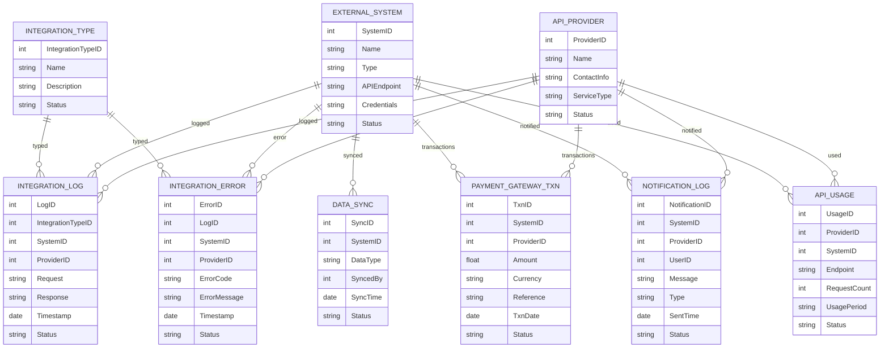

# Module 16: Integration – Entity Design (Based on Module Wise Features.txt SRS)

## 1. Master Entities

| Entity Name       | Description                          | Suggested Fields                                         |
|-------------------|--------------------------------------|---------------------------------------------------------|
| IntegrationType   | Type/category of integration         | IntegrationTypeID, Name, Description, Status            |
| ExternalSystem    | External system/platform             | SystemID, Name, Type, APIEndpoint, Credentials, Status  |
| APIProvider       | API provider master                  | ProviderID, Name, ContactInfo, ServiceType, Status      |

## 2. Transaction Entities

| Entity Name       | Description                          | Suggested Fields                                         |
|-------------------|--------------------------------------|---------------------------------------------------------|
| IntegrationLog    | Integration log/record               | LogID, IntegrationTypeID, SystemID, ProviderID, Request, Response, Timestamp, Status |
| DataSync          | Data synchronization event            | SyncID, SystemID, DataType, SyncedBy, SyncTime, Status  |
| PaymentGatewayTxn | Payment gateway transaction           | TxnID, SystemID, ProviderID, Amount, Currency, Reference, TxnDate, Status |
| NotificationLog   | SMS/Email/WhatsApp notification log  | NotificationID, SystemID, ProviderID, UserID, Message, Type, SentTime, Status |
| APIUsage          | API usage tracking                   | UsageID, ProviderID, SystemID, Endpoint, RequestCount, UsagePeriod, Status |
| IntegrationError  | Error/exception in integration        | ErrorID, LogID, SystemID, ProviderID, ErrorCode, ErrorMessage, Timestamp, Status |

## 3. Relations/Dependencies

- **IntegrationLog**, **APIUsage**, **PaymentGatewayTxn**, **NotificationLog**, **IntegrationError** reference **ExternalSystem** and **APIProvider**
- **IntegrationLog**, **IntegrationError** reference **IntegrationType**
- **DataSync** references **ExternalSystem**

---

## 4. Mermaid ER Diagram

