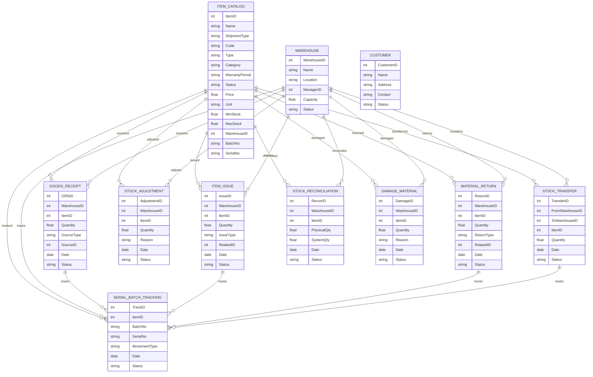

# Module 7: Inventory Management – Entity Design (Based on Module Wise Features.txt SRS)

## 1. Master Entities

| Entity Name   | Description                                  | Suggested Fields                                                        |
|---------------|----------------------------------------------|------------------------------------------------------------------------|
| ItemCatalog   | Item definition/catalog                      | ItemID, Name, ShipmentType, Code, Type, Category, WarrantyPeriod, Status, Price, Unit, MinStock, MaxStock, WarehouseID, BatchNo, SerialNo |
| Warehouse     | Warehouse master                             | WarehouseID, Name, Location, ManagerID, Capacity, Status                |
| Customer      | Customer details (for returns/warranty)      | CustomerID, Name, Address, Contact, Status                              |

## 2. Transaction Entities

| Entity Name       | Description                                  | Suggested Fields                                                      |
|-------------------|----------------------------------------------|----------------------------------------------------------------------|
| GoodsReceipt      | Goods receipt/GRN                            | GRNID, WarehouseID, ItemID, Quantity, SourceType, SourceID, Date, Status |
| ItemIssue         | Item issue (sale/service/adjustment)         | IssueID, WarehouseID, ItemID, Quantity, IssueType, RelatedID, Date, Status |
| MaterialReturn    | Material return (sale/service/adjustment)    | ReturnID, WarehouseID, ItemID, Quantity, ReturnType, RelatedID, Date, Status |
| StockAdjustment   | Adjustment (damage, others)                  | AdjustmentID, WarehouseID, ItemID, Quantity, Reason, Date, Status      |
| StockTransfer     | Stock transfer (between warehouses/dept)     | TransferID, FromWarehouseID, ToWarehouseID, ItemID, Quantity, Date, Status |
| StockReconciliation| Stock reconciliation                        | ReconID, WarehouseID, ItemID, PhysicalQty, SystemQty, Date, Status    |
| DamageMaterial    | Damage material recording                    | DamageID, WarehouseID, ItemID, Quantity, Reason, Date, Status         |
| SerialBatchTracking| Serial/batch tracking                       | TrackID, ItemID, BatchNo, SerialNo, MovementType, Date, Status        |

## 3. Relations/Dependencies

- **ItemIssue**, **GoodsReceipt**, **MaterialReturn**, **StockAdjustment**, **StockTransfer**, **StockReconciliation**, **DamageMaterial** all reference **ItemCatalog** and **Warehouse**
- **GoodsReceipt**, **MaterialReturn** reference **SourceType** (e.g., Sale, Service, Adjustment) and **SourceID** (sale/service/other transaction)
- **SerialBatchTracking** references **ItemCatalog**, batch/serial info, and is linked to movements

---

## 4. Mermaid ER Diagram

