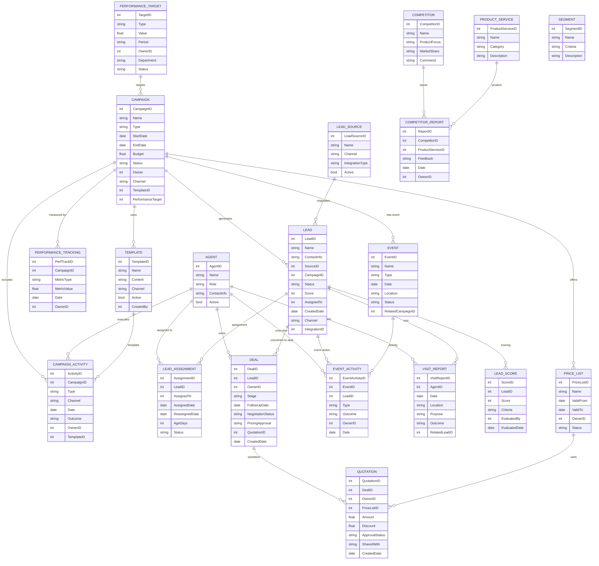

# Module 1: Marketing Management – Entity Design (Based on Module Wise Features.txt)

## 1. Master Entities

| Entity Name         | Description                             | Suggested Fields                                                  |
|---------------------|-----------------------------------------|------------------------------------------------------------------|
| Campaign            | Marketing campaigns                      | CampaignID, Name, Type, StartDate, EndDate, Budget, Status, Owner, Channel, TemplateID, PerformanceTarget |
| Template            | SMS/Email/WhatsApp templates             | TemplateID, Name, Content, Channel, Active, CreatedBy            |
| Event               | Upcoming events                          | EventID, Name, Type, Date, Location, Status, RelatedCampaignID    |
| LeadSource          | Lead source (Online/Offline/3rd Party)   | LeadSourceID, Name, Channel, IntegrationType, Active              |
| ProductService      | Products/services offered                | ProductServiceID, Name, Category, Description                     |
| Segment             | Target customer segment                  | SegmentID, Name, Criteria, Description                            |
| Agent               | Agents/ISD/Technicians/Workers           | AgentID, Name, Role, ContactInfo, Active                          |
| PerformanceTarget   | Budget/Targets/ABP/Employee/Partner      | TargetID, Type, Value, Period, OwnerID, Department, Status        |
| PriceList           | Price list/scheme/offer management       | PriceListID, Name, ValidFrom, ValidTo, OwnerID, Status            |
| Competitor          | Competitor’s data                        | CompetitorID, Name, ProductFocus, MarketShare, Comments           |

## 2. Transaction Entities

| Entity Name         | Description                             | Suggested Fields                                                  |
|---------------------|-----------------------------------------|------------------------------------------------------------------|
| Lead                | Individual lead record                   | LeadID, Name, ContactInfo, SourceID, CampaignID, Status, Score, AssignedTo, CreatedDate, Channel, IntegrationID |
| LeadAssignment      | Lead assignment/reassignment/ageing      | AssignmentID, LeadID, AssignedTo, AssignedDate, ReassignedDate, AgeDays, Status |
| LeadScore           | Lead scoring/evaluation                  | ScoreID, LeadID, Score, Criteria, EvaluatedBy, EvaluatedDate     |
| Deal                | Lead to deal conversion                  | DealID, LeadID, OwnerID, Stage, FollowUpDate, NegotiationStatus, PricingApproval, QuotationID, CreatedDate |
| Quotation           | Quotation management                     | QuotationID, DealID, OwnerID, PriceListID, Amount, Discount, ApprovalStatus, SharedWith, CreatedDate |
| CampaignActivity    | SMS/Email/WhatsApp/Followup              | ActivityID, CampaignID, Type, Channel, Date, Outcome, OwnerID, TemplateID |
| PerformanceTracking | Track campaign activity/performance      | PerfTrackID, CampaignID, MetricType, MetricValue, Date, OwnerID  |
| EventActivity       | Event actions (attendance, follow-up)    | EventActivityID, EventID, LeadID, Type, Outcome, OwnerID, Date   |
| CompetitorReport    | Competitor feedback/market info          | ReportID, CompetitorID, ProductServiceID, Feedback, Date, OwnerID|
| VisitReport         | Travel/visit plan and actual report      | VisitReportID, AgentID, Date, Location, Purpose, Outcome, RelatedLeadID |

## 3. Relations/Dependencies

- **Lead** references **Campaign**, **LeadSource**, **Agent**, **Channel**, and can link to **Event**
- **LeadAssignment** references **Lead** and **Agent**
- **LeadScore** references **Lead**
- **Deal** references **Lead**, **Agent**, **Quotation**
- **Quotation** references **Deal**, **PriceList**, **Owner**
- **CampaignActivity** references **Campaign**, **Template**, **Agent**
- **PerformanceTracking** references **Campaign**
- **EventActivity** references **Event**, **Lead**, **Agent**
- **CompetitorReport** references **Competitor**, **ProductService**
- **VisitReport** references **Agent**, **Lead**

---

## 4. Mermaid ER Diagram

