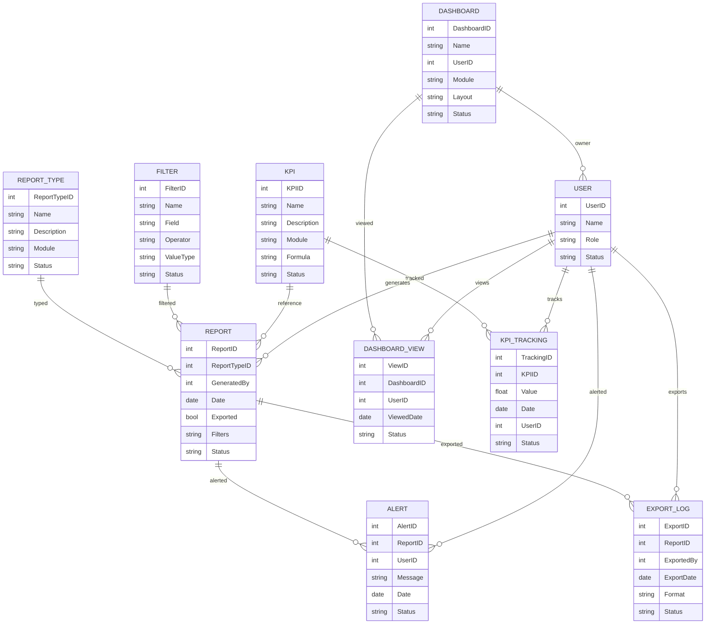

# Module 13: MIS Reporting & Dashboard – Entity Design (Based on Module Wise Features.txt SRS)

## 1. Master Entities

| Entity Name   | Description                    | Suggested Fields                                         |
|---------------|-------------------------------|---------------------------------------------------------|
| ReportType    | Type/category of report        | ReportTypeID, Name, Description, Module, Status         |
| Dashboard     | Dashboard configuration        | DashboardID, Name, UserID, Module, Layout, Status       |
| KPI           | Key Performance Indicator      | KPIID, Name, Description, Module, Formula, Status       |
| Filter        | Report filter master           | FilterID, Name, Field, Operator, ValueType, Status      |

## 2. Transaction Entities

| Entity Name   | Description                    | Suggested Fields                                         |
|---------------|-------------------------------|---------------------------------------------------------|
| Report        | MIS report record              | ReportID, ReportTypeID, GeneratedBy, Date, Exported, Filters, Status |
| DashboardView | User dashboard view            | ViewID, DashboardID, UserID, ViewedDate, Status         |
| KPITracking   | KPI tracking/log               | TrackingID, KPIID, Value, Date, UserID, Status          |
| Alert         | Business alert/notification    | AlertID, ReportID, UserID, Message, Date, Status        |
| ExportLog     | Report export log              | ExportID, ReportID, ExportedBy, ExportDate, Format, Status |

## 3. Relations/Dependencies

- **Report** references **ReportType**, **User** (GeneratedBy), **Filters**
- **DashboardView** references **Dashboard**, **User**
- **KPITracking** references **KPI**, **User**
- **Alert** references **Report**, **User**
- **ExportLog** references **Report**, **User**

---

## 4. Mermaid ER Diagram

