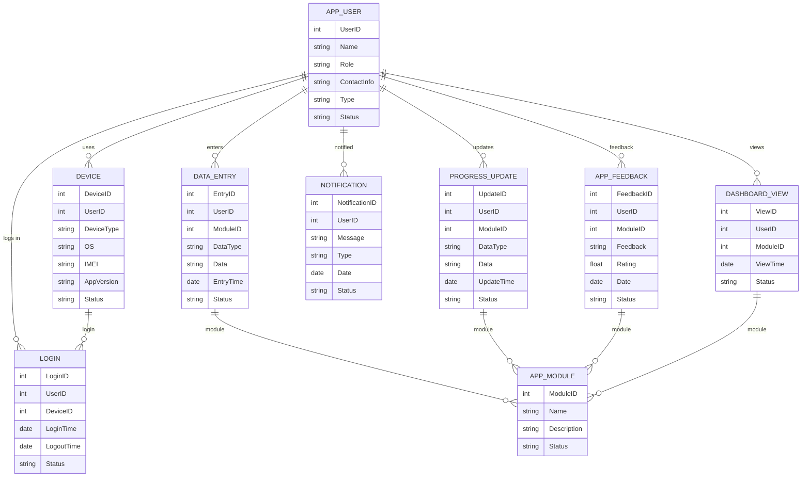

# Module 14: Mobile App – Entity Design (Based on Module Wise Features.txt SRS)

## 1. Master Entities

| Entity Name   | Description                        | Suggested Fields                                         |
|---------------|------------------------------------|---------------------------------------------------------|
| AppUser       | Mobile app user                    | UserID, Name, Role, ContactInfo, Type, Status           |
| Device        | Mobile device master               | DeviceID, UserID, DeviceType, OS, IMEI, AppVersion, Status |
| AppModule     | Module available in app            | ModuleID, Name, Description, Status                     |

## 2. Transaction Entities

| Entity Name   | Description                        | Suggested Fields                                         |
|---------------|------------------------------------|---------------------------------------------------------|
| Login         | User login record                  | LoginID, UserID, DeviceID, LoginTime, LogoutTime, Status|
| DataEntry     | Data entry from app                | EntryID, UserID, ModuleID, DataType, Data, EntryTime, Status |
| ProgressUpdate| Field progress/status update       | UpdateID, UserID, ModuleID, DataType, Data, UpdateTime, Status |
| Notification  | App notification                   | NotificationID, UserID, Message, Type, Date, Status     |
| AppFeedback   | User feedback/report               | FeedbackID, UserID, ModuleID, Feedback, Rating, Date, Status |
| DashboardView | Dashboard view from app            | ViewID, UserID, ModuleID, ViewTime, Status              |

## 3. Relations/Dependencies

- **AppUser** is linked to **Device**, **Login**, **DataEntry**, **ProgressUpdate**, **Notification**, **AppFeedback**, **DashboardView**
- **AppModule** is referenced in **DataEntry**, **ProgressUpdate**, **DashboardView**, **AppFeedback**
- **Device** is referenced in **Login**

---

## 4. Mermaid ER Diagram

