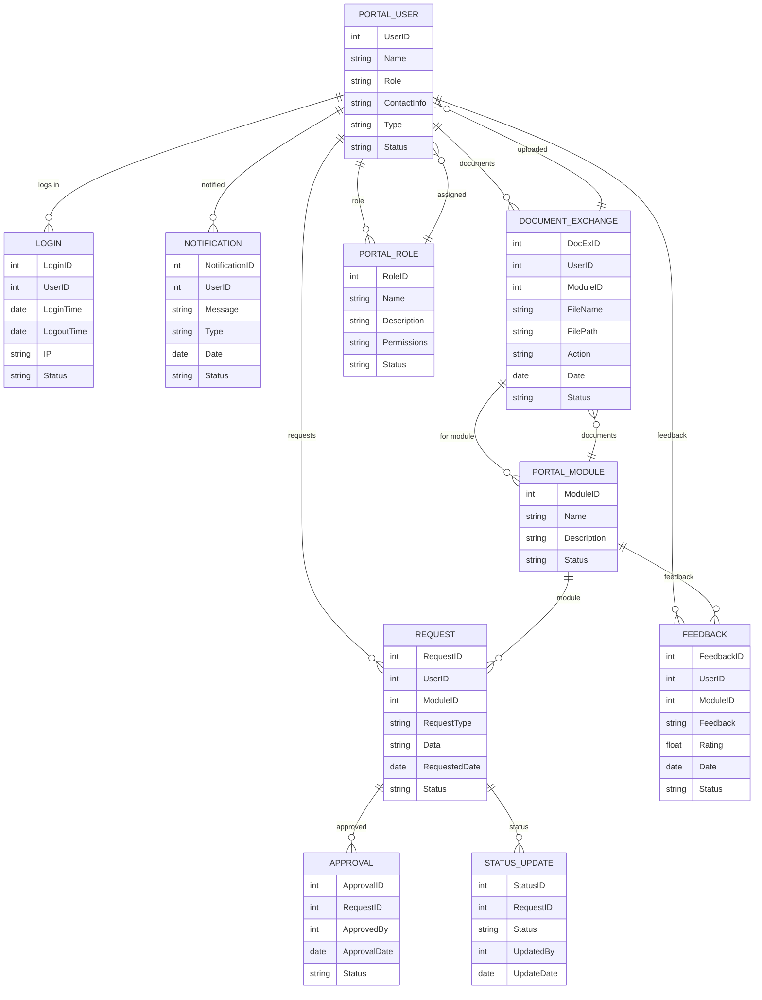

# Module 15: Portal – Entity Design (Based on Module Wise Features.txt SRS)

## 1. Master Entities

| Entity Name   | Description                        | Suggested Fields                                         |
|---------------|------------------------------------|---------------------------------------------------------|
| PortalUser    | Portal user                        | UserID, Name, Role, ContactInfo, Type, Status           |
| PortalModule  | Portal module                      | ModuleID, Name, Description, Status                     |
| PortalRole    | Portal role & permissions          | RoleID, Name, Description, Permissions, Status          |

## 2. Transaction Entities

| Entity Name   | Description                        | Suggested Fields                                         |
|---------------|------------------------------------|---------------------------------------------------------|
| Login         | Portal login record                | LoginID, UserID, LoginTime, LogoutTime, IP, Status      |
| Request       | Workflow/request from portal       | RequestID, UserID, ModuleID, RequestType, Data, RequestedDate, Status |
| Approval      | Approval workflow                  | ApprovalID, RequestID, ApprovedBy, ApprovalDate, Status |
| DocumentExchange| Document upload/download         | DocExID, UserID, ModuleID, FileName, FilePath, Action, Date, Status |
| Feedback      | User feedback                      | FeedbackID, UserID, ModuleID, Feedback, Rating, Date, Status |
| Notification  | Portal notification                | NotificationID, UserID, Message, Type, Date, Status     |
| StatusUpdate  | Request/status update              | StatusID, RequestID, Status, UpdatedBy, UpdateDate      |

## 3. Relations/Dependencies

- **PortalUser** linked to **Login**, **Request**, **Feedback**, **Notification**, **DocumentExchange**
- **PortalModule** referenced in **Request**, **Feedback**, **DocumentExchange**
- **PortalRole** assigned to **PortalUser**
- **Approval** references **Request**
- **StatusUpdate** references **Request**
- **DocumentExchange** references **PortalUser**, **PortalModule**

---

## 4. Mermaid ER Diagram

