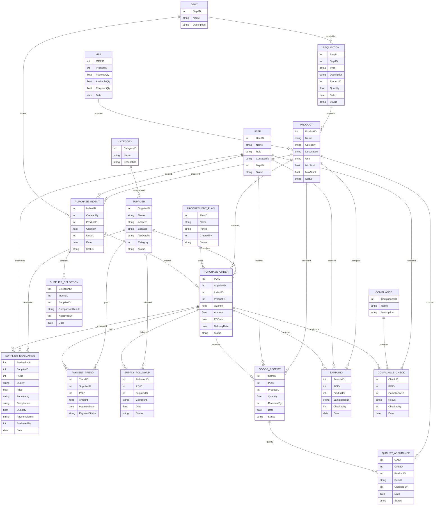

# Module 3: Procurement Management – Entity Design (Based on Module Wise Features.txt)

## 1. Master Entities

| Entity Name        | Description                             | Suggested Fields                                                       |
|--------------------|-----------------------------------------|-----------------------------------------------------------------------|
| Supplier           | Supplier database (local/import)        | SupplierID, Name, Address, Contact, TaxDetails, Category, Status      |
| Category           | Supplier category (local/import)        | CategoryID, Name, Description                                         |
| User               | Procurement users                       | UserID, Name, Role, ContactInfo, DeptID, Status                       |
| Product            | Products/Materials                      | ProductID, Name, Category, Description, Unit, MinStock, MaxStock, Status |
| Compliance         | Compliance requirements                 | ComplianceID, Name, Description                                       |
| ProcurementPlan    | Procurement plan master                 | PlanID, Name, Period, CreatedBy, Status                               |

## 2. Transaction Entities

| Entity Name        | Description                             | Suggested Fields                                                       |
|--------------------|-----------------------------------------|-----------------------------------------------------------------------|
| PurchaseIndent     | Purchase indent (requisition)           | IndentID, CreatedBy, ProductID, Quantity, DeptID, Date, Status        |
| SupplierSelection  | Supplier selection/comparison           | SelectionID, IndentID, SupplierID, ComparisonResult, ApprovedBy, Date |
| PurchaseOrder      | Purchase order                          | POID, SupplierID, IndentID, ProductID, Quantity, Amount, PODate, DeliveryDate, Status |
| GoodsReceipt       | Goods receipt/GRN                       | GRNID, POID, ProductID, Quantity, ReceivedBy, Date, Status            |
| ComplianceCheck    | Compliance check                        | CheckID, POID, ComplianceID, Result, CheckedBy, Date                  |
| Sampling           | Sampling/Quality check                  | SampleID, POID, ProductID, SampleResult, CheckedBy, Date              |
| PaymentTrend       | Purchase/payment trend                  | TrendID, SupplierID, POID, Amount, PaymentDate, PaymentStatus         |
| SupplyFollowup     | Supply follow-up/tracking               | FollowupID, POID, SupplierID, Comment, Date, Status                   |
| SupplierEvaluation | Supplier evaluation                     | EvaluationID, SupplierID, POID, Quality, Price, Punctuality, Compliance, Quantity, PaymentTerms, EvaluatedBy, Date |
| Requisition        | Requisition for material/manpower       | ReqID, DeptID, Type, Description, ProductID, Quantity, Date, Status   |
| MRP                | Material requirement planning           | MRPID, ProductID, PlannedQty, AvailableQty, RequiredQty, Date         |
| QualityAssurance   | Quality assurance for purchased items   | QAID, GRNID, ProductID, Result, CheckedBy, Date, Status               |

## 3. Relations/Dependencies

- **PurchaseIndent** references **User**, **Product**, **Dept**
- **SupplierSelection** references **PurchaseIndent**, **Supplier**
- **PurchaseOrder** references **Supplier**, **PurchaseIndent**, **Product**
- **GoodsReceipt** references **PurchaseOrder**, **Product**, **User**
- **ComplianceCheck**, **Sampling**, **QualityAssurance** reference **PurchaseOrder**, **Product**, **User**
- **PaymentTrend** references **Supplier**, **PurchaseOrder**
- **SupplyFollowup** references **PurchaseOrder**, **Supplier**
- **SupplierEvaluation** references **Supplier**, **PurchaseOrder**
- **Requisition** references **Dept**, **Product**
- **MRP** references **Product**

---

## 4. Mermaid ER Diagram

