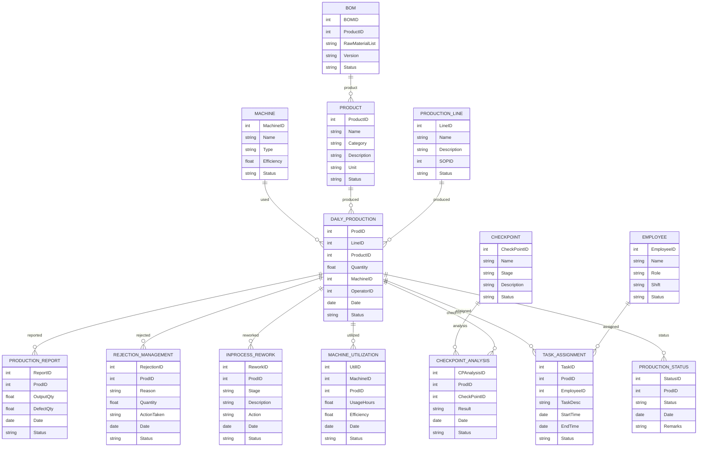

# Module 9: Production Management – Entity Design (Based on Module Wise Features.txt SRS)

## 1. Master Entities

| Entity Name         | Description                                  | Suggested Fields                                                        |
|---------------------|----------------------------------------------|------------------------------------------------------------------------|
| ProductionLine      | Production line master                       | LineID, Name, Description, SOPID, Status                               |
| Product             | Product master                               | ProductID, Name, Category, Description, Unit, Status                   |
| BOM                 | Bill of Material master                      | BOMID, ProductID, RawMaterialList, Version, Status                     |
| Machine             | Machines for production                      | MachineID, Name, Type, Efficiency, Status                              |
| Employee            | Employee/Labor master                        | EmployeeID, Name, Role, Shift, Status                                  |
| CheckPoint          | Quality/Process checkpoint                   | CheckPointID, Name, Stage, Description, Status                         |

## 2. Transaction Entities

| Entity Name           | Description                                  | Suggested Fields                                                        |
|-----------------------|----------------------------------------------|------------------------------------------------------------------------|
| DailyProduction       | Daily production record                      | ProdID, LineID, ProductID, Quantity, MachineID, OperatorID, Date, Status|
| ProductionReport      | Production reporting                         | ReportID, ProdID, OutputQty, DefectQty, Date, Status                   |
| RejectionManagement   | Rejection management                         | RejectionID, ProdID, Reason, Quantity, ActionTaken, Date, Status       |
| InProcessRework       | In-process rejection/rework                  | ReworkID, ProdID, Stage, Description, Action, Date, Status             |
| CheckPointAnalysis    | Analysis at checkpoints                      | CPAnalysisID, ProdID, CheckPointID, Result, Date, Status               |
| MachineUtilization    | Machine utilization tracking                  | UtilID, MachineID, ProdID, UsageHours, Efficiency, Date, Status        |
| TaskAssignment        | Labor/task tracking                          | TaskID, ProdID, EmployeeID, TaskDesc, StartTime, EndTime, Status       |
| ProductionStatus      | Production status                            | StatusID, ProdID, Status, Date, Remarks                                |

## 3. Relations/Dependencies

- **DailyProduction** references **ProductionLine**, **Product**, **Machine**, **Employee**
- **ProductionReport**, **RejectionManagement**, **InProcessRework**, **CheckPointAnalysis**, **MachineUtilization**, **TaskAssignment**, **ProductionStatus** all reference **ProdID** (DailyProduction)
- **CheckPointAnalysis** references **CheckPoint**
- **TaskAssignment** references **Employee**

---

## 4. Mermaid ER Diagram

