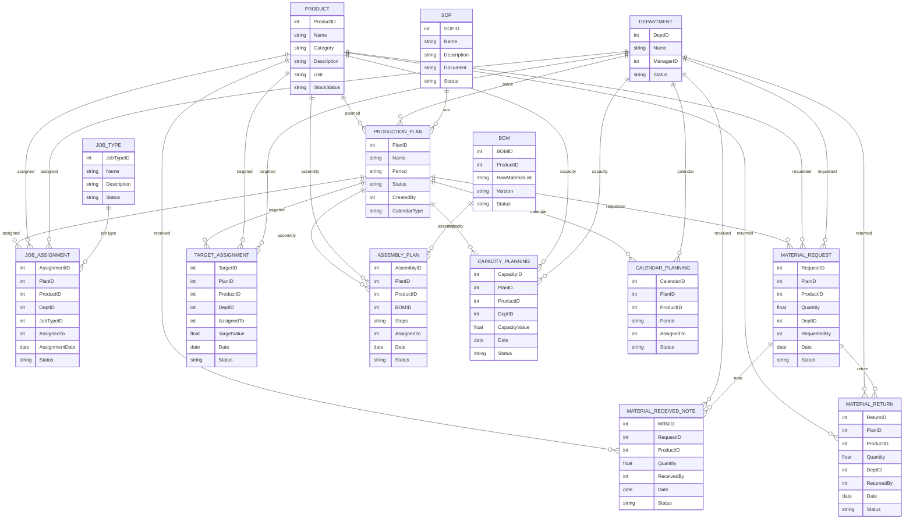

# Module 8: Production Planning Management – Entity Design (Based on Module Wise Features.txt SRS)

## 1. Master Entities

| Entity Name         | Description                                  | Suggested Fields                                                        |
|---------------------|----------------------------------------------|------------------------------------------------------------------------|
| ProductionPlan      | Production plan master                       | PlanID, Name, Period, Status, CreatedBy, CalendarType                  |
| Product             | Product/FG master                            | ProductID, Name, Category, Description, Unit, StockStatus              |
| BOM                 | Bill of Material                             | BOMID, ProductID, RawMaterialList, Version, Status                     |
| JobType             | Job type (Assembly/Manual/Calendar)          | JobTypeID, Name, Description, Status                                   |
| SOP                 | SOP master                                   | SOPID, Name, Description, Document, Status                             |
| Department          | Department master                            | DeptID, Name, ManagerID, Status                                        |

## 2. Transaction Entities

| Entity Name           | Description                                  | Suggested Fields                                                        |
|-----------------------|----------------------------------------------|------------------------------------------------------------------------|
| JobAssignment         | Job assignments (delegation to users)        | AssignmentID, PlanID, ProductID, DeptID, JobTypeID, AssignedTo, AssignmentDate, Status |
| MaterialRequest       | Material request for production              | RequestID, PlanID, ProductID, Quantity, DeptID, RequestedBy, Date, Status |
| MaterialReceivedNote  | Received material notes                      | MRNID, RequestID, ProductID, Quantity, ReceivedBy, Date, Status         |
| MaterialReturn        | Material return management                   | ReturnID, PlanID, ProductID, Quantity, DeptID, ReturnedBy, Date, Status |
| CapacityPlanning      | Capacity planning for production             | CapacityID, PlanID, ProductID, DeptID, CapacityValue, Date, Status      |
| TargetAssignment      | Target assignments for jobs                  | TargetID, PlanID, ProductID, DeptID, AssignedTo, TargetValue, Date, Status |
| AssemblyPlan          | Assembly plan/steps generation               | AssemblyID, PlanID, ProductID, BOMID, Steps, AssignedTo, Date, Status   |
| CalendarPlanning      | Planning by calendar                         | CalendarID, PlanID, ProductID, Period, AssignedTo, Status               |

## 3. Relations/Dependencies

- **ProductionPlan** links to **Product**, **BOM**, **Department**, **JobType**, **SOP**
- **JobAssignment**, **MaterialRequest**, **TargetAssignment** reference **ProductionPlan**, **Product**, **Dept**
- **MaterialReceivedNote** and **MaterialReturn** reference **MaterialRequest**, **Product**, **Dept**
- **AssemblyPlan** references **ProductionPlan**, **Product**, **BOM**
- **CapacityPlanning**, **CalendarPlanning** reference **ProductionPlan**, **Product**, **Dept**

---

## 4. Mermaid ER Diagram

