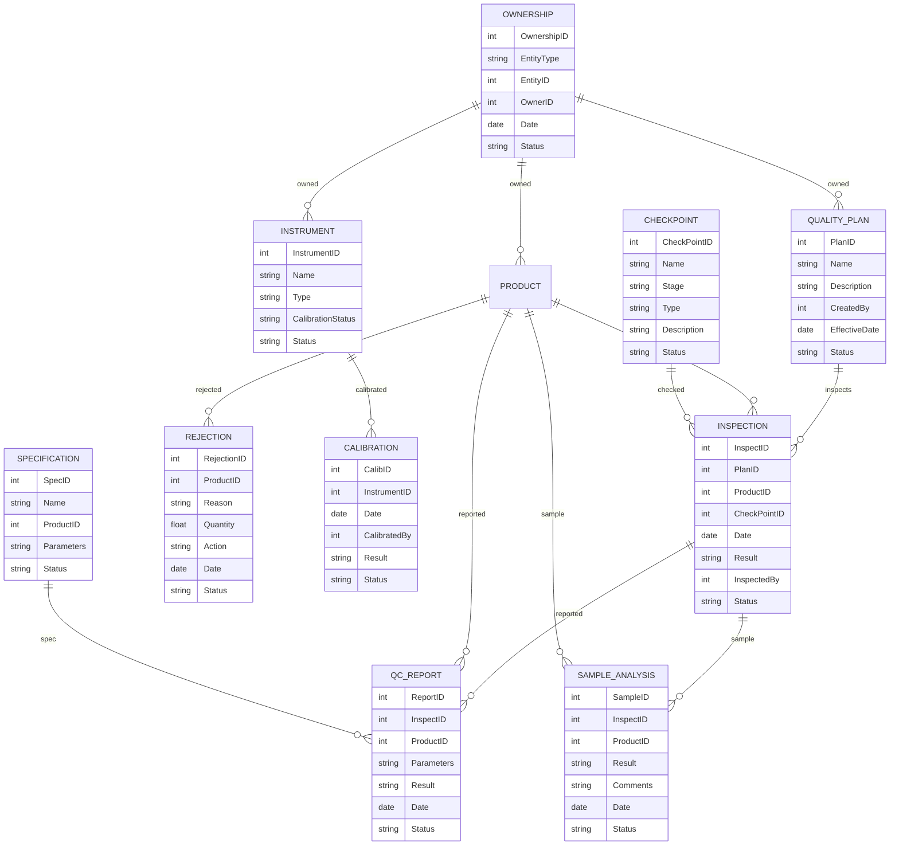

# Module 10: Quality Control Management – Entity Design (Based on Module Wise Features.txt SRS)

## 1. Master Entities

| Entity Name      | Description                          | Suggested Fields                                        |
|------------------|--------------------------------------|--------------------------------------------------------|
| QualityPlan      | Quality plan master                   | PlanID, Name, Description, CreatedBy, EffectiveDate, Status |
| CheckPoint       | Quality/process checkpoints           | CheckPointID, Name, Stage, Type, Description, Status   |
| Instrument       | Instruments/tools for QC              | InstrumentID, Name, Type, CalibrationStatus, Status    |
| Specification    | Quality specification master          | SpecID, Name, ProductID, Parameters, Status            |

## 2. Transaction Entities

| Entity Name      | Description                          | Suggested Fields                                        |
|------------------|--------------------------------------|--------------------------------------------------------|
| Inspection       | Inspection/test record                | InspectID, PlanID, ProductID, CheckPointID, Date, Result, InspectedBy, Status |
| QCReport         | QC report/analysis                    | ReportID, InspectID, ProductID, Parameters, Result, Date, Status |
| Rejection        | Rejection/rework analysis             | RejectionID, ProductID, Reason, Quantity, Action, Date, Status |
| Calibration      | Instrument/tool calibration           | CalibID, InstrumentID, Date, CalibratedBy, Result, Status |
| Ownership        | Material/machine ownership record     | OwnershipID, EntityType, EntityID, OwnerID, Date, Status |
| SampleAnalysis   | Sample piece analysis                 | SampleID, InspectID, ProductID, Result, Comments, Date, Status |

## 3. Relations/Dependencies

- **Inspection** references **QualityPlan**, **Product**, **CheckPoint**
- **QCReport** references **Inspection**, **Product**
- **Rejection** references **Product**
- **Calibration** references **Instrument**
- **Ownership** references any entity (material/machine)
- **SampleAnalysis** references **Inspection**, **Product**

---

## 4. Mermaid ER Diagram

