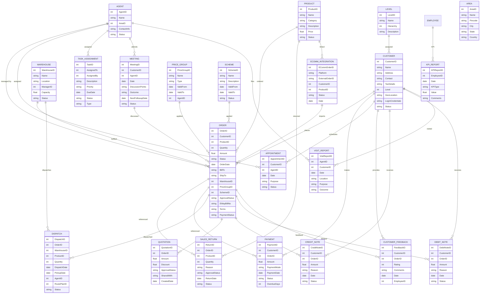

# Module 2: Sales Management – Entity Design (Based on Module Wise Features.txt)

## 1. Master Entities

| Entity Name       | Description                       | Suggested Fields                                                      |
|-------------------|-----------------------------------|----------------------------------------------------------------------|
| Customer          | Customer master                   | CustomerID, Name, Address, Contact, TaxDetails, Level, GeoLocation, LoginCredentials, Status |
| Level             | Customer level (End User, Dealer, Distributor, etc.) | LevelID, Name, Hierarchy, Description                                |
| Area              | GeoFencing/Area master            | AreaID, Name, Pincode, City, State, Country                          |
| Product           | Product catalog                   | ProductID, Name, Category, Description, Price, Status                |
| Warehouse         | Warehouse master                  | WarehouseID, Name, Location, ManagerID, Capacity, Status             |
| PriceGroup        | Price group/scheme                | PriceGroupID, Name, Type, ValidFrom, ValidTo, AgentID                |
| Scheme            | Scheme master                     | SchemeID, Name, Description, ValidFrom, ValidTo, Status              |
| Agent             | Sales Agents                      | AgentID, Name, AreaID, ContactInfo, Status                           |

## 2. Transaction Entities

| Entity Name       | Description                       | Suggested Fields                                                      |
|-------------------|-----------------------------------|----------------------------------------------------------------------|
| Order             | Sales order                       | OrderID, CustomerID, ProductID, Quantity, Amount, Status, OrderDate, BillTo, ShipTo, WarehouseID, PriceGroupID, SchemeID, ApprovalStatus, EWayBillNo, Terms, PaymentStatus |
| SalesReturn       | Sales return                      | ReturnID, OrderID, ProductID, Quantity, Reason, ApprovalStatus, ReturnDate, Status |
| Payment           | Payments received                 | PaymentID, CustomerID, OrderID, Amount, PaymentMode, PaymentDate, Status, OverdueDays |
| Dispatch          | Dispatches and Pickups            | DispatchID, OrderID, WarehouseID, ProductID, Quantity, DispatchDate, PickupDate, AgentID, RoutePlanID, Status |
| Appointment       | Appointment scheduling            | AppointmentID, CustomerID, AgentID, Date, Purpose, Status            |
| TaskAssignment    | Task assignments for Sales Team   | TaskID, AssignedTo, AssignedBy, Description, Priority, DueDate, Status, Type |
| CustomerFeedback  | Customer feedback/rating          | FeedbackID, CustomerID, OrderID, Rating, Comments, Date, EmployeeID  |
| Meeting           | Sales meeting                     | MeetingID, CustomerID, AgentID, Date, DiscussionPoints, Outcome, NextFollowupDate, Status |
| Quotation         | Quotation management              | QuotationID, OrderID, Amount, Discount, ApprovalStatus, SharedWith, CreatedDate |
| CreditNote        | Credit note                       | CreditNoteID, CustomerID, OrderID, Amount, Reason, Date, Status      |
| DebitNote         | Debit note                        | DebitNoteID, CustomerID, OrderID, Amount, Reason, Date, Status       |
| VisitReport       | Sales visit report                | VisitReportID, AgentID, CustomerID, Date, Location, Purpose, Outcome |
| KPIReport         | KPI and Ratio Analysis            | KPIReportID, EmployeeID, Date, KPIType, Value, Comments              |
| ECommIntegration  | E-commerce order integration      | ECommOrderID, Platform, ExternalOrderID, CustomerID, ProductID, Status, Date |

## 3. Relations/Dependencies

- **Order** references **Customer**, **Product**, **PriceGroup**, **Scheme**, **Warehouse**, **Agent**
- **SalesReturn** references **Order**, **Product**
- **Payment** references **Customer**, **Order**
- **Dispatch** references **Order**, **Warehouse**, **Product**, **Agent**
- **Appointment**, **TaskAssignment** reference **Customer**, **Agent**
- **CustomerFeedback** references **Customer**, **Order**, **Employee**
- **Meeting** references **Customer**, **Agent**
- **Quotation** references **Order**
- **CreditNote/DebitNote** reference **Customer**, **Order**
- **VisitReport** references **Agent**, **Customer**
- **KPIReport** references **Employee**
- **ECommIntegration** references **Customer**, **Product**

---

## 4. Mermaid ER Diagram

