# Module 5: Service Management – Entity Design (Based on Module Wise Features.txt)

## 1. Master Entities

| Entity Name         | Description                                  | Suggested Fields                                                      |
|---------------------|----------------------------------------------|----------------------------------------------------------------------|
| ServiceCentre       | Service center master                        | ServiceCentreID, Name, Location, Type, ContactInfo, Status           |
| Agency              | Agency master (company/tie-ups)              | AgencyID, Name, Type, ContactInfo, Status                            |
| Technician          | Technicians/Workers/Agents                   | TechnicianID, Name, Role, ContactInfo, Status                        |
| Product             | Product details (Model, Serial No., etc.)    | ProductID, Name, Model, SerialNumber, Category, WarrantyPeriod, Status|
| Customer            | Customer details                             | CustomerID, Name, Address, Contact, RelationType, Status             |
| SLAAgreement        | Service Level Agreements                     | SLAID, CustomerID, ServiceCentreID, Terms, StartDate, EndDate, Status|
| ServiceWarehouse    | Service warehouse                            | WarehouseID, Name, Location, Capacity, Status                        |

## 2. Transaction Entities

| Entity Name         | Description                                  | Suggested Fields                                                      |
|---------------------|----------------------------------------------|----------------------------------------------------------------------|
| Warranty            | Warranty management                          | WarrantyID, CustomerID, ProductID, StartDate, EndDate, Status, Documents |
| ServiceCall         | Service call/job registration                | ServiceCallID, CustomerID, ProductID, WarrantyID, ComplaintType, Location, Remarks, Status, RegisteredDate |
| CallAssignment      | Call/job assignment/reassignment             | AssignmentID, ServiceCallID, TechnicianID, ServiceCentreID, AssignedDate, ReassignedDate, Status |
| SparePartRequest    | Spare part requisition                       | RequestID, ServiceCallID, TechnicianID, ProductID, Quantity, Date, Status |
| SparePartIssue      | Spare part issue                             | IssueID, RequestID, ProductID, Quantity, IssuedBy, Date, Status      |
| VisitManagement     | Visit management (service center, technician)| VisitID, ServiceCallID, TechnicianID, Date, Location, Purpose, Status|
| ServiceCompletion   | Service call completion                      | CompletionID, ServiceCallID, Photos, Videos, Remarks, ReturnedParts, PaymentID, CompletedDate, Status |
| Payment            | Payments for service                          | PaymentID, ServiceCallID, CustomerID, Amount, PaymentMode, PaymentDate, Status |
| Feedback           | Feedback after service                        | FeedbackID, ServiceCallID, CustomerID, Rating, Comments, Date, Status|
| SpareStock         | Spare stock management                        | SpareID, ProductID, WarehouseID, Quantity, MinLevel, MaxLevel, Status|
| MaterialRequisition| New material requisition                      | RequisitionID, ProductID, WarehouseID, Quantity, RequestedBy, Date, Status|
| ServiceInvoice     | Service invoicing                             | InvoiceID, ServiceCallID, CustomerID, Amount, Discount, TaxDetails, PaymentStatus, Date |
| ComplaintAnalysis  | Complaints booking and analysis               | ComplaintID, ServiceCallID, Type, Description, RatioAnalysis, Expenses, KPI, Date, Status |
| SLAActivity        | SLA periodic management and tracking          | SLAActivityID, SLAID, ServiceCallID, ActivityType, ScheduledDate, CompletedDate, Status |
| AgentAssignment    | Agent assignment                              | AssignmentID, TechnicianID, ServiceCallID, AssignedDate, Status      |

## 3. Relations/Dependencies

- **Warranty** references **Customer**, **Product**
- **ServiceCall** references **Customer**, **Product**, **Warranty**
- **CallAssignment** references **ServiceCall**, **Technician**, **ServiceCentre**
- **SparePartRequest** references **ServiceCall**, **Technician**, **Product**
- **SparePartIssue** references **SparePartRequest**, **Product**, **User**
- **VisitManagement** references **ServiceCall**, **Technician**
- **ServiceCompletion** references **ServiceCall**, **Payment**, **ReturnedParts**
- **Payment** references **ServiceCall**, **Customer**
- **Feedback** references **ServiceCall**, **Customer**
- **SpareStock** references **Product**, **ServiceWarehouse**
- **MaterialRequisition** references **Product**, **ServiceWarehouse**
- **ServiceInvoice** references **ServiceCall**, **Customer**
- **ComplaintAnalysis** references **ServiceCall**
- **SLAActivity** references **SLAAgreement**, **ServiceCall**
- **AgentAssignment** references **Technician**, **ServiceCall**

---

## 4. Mermaid ER Diagram

```mermaid
erDiagram
    CUSTOMER ||--o{ WARRANTY : "warranty"
    CUSTOMER ||--o{ SERVICE_CALL : "calls"
    CUSTOMER ||--o{ PAYMENT : "pays"
    CUSTOMER ||--o{ FEEDBACK : "feedback"
    SERVICE_CALL ||--o{ CALL_ASSIGNMENT : "assigns"
    SERVICE_CALL ||--o{ SPARE_PART_REQUEST : "requests"
    SERVICE_CALL ||--o{ VISIT_MANAGEMENT : "visited"
    SERVICE_CALL ||--o{ SERVICE_COMPLETION : "completed"
    SERVICE_CALL ||--o{ PAYMENT : "paid"
    SERVICE_CALL ||--o{ FEEDBACK : "feedback"
    SERVICE_CALL ||--o{ SERVICE_INVOICE : "invoiced"
    SERVICE_CALL ||--o{ COMPLAINT_ANALYSIS : "complaints"
    SERVICE_CALL ||--o{ SLA_ACTIVITY : "sla"
    CALL_ASSIGNMENT ||--o{ TECHNICIAN : "assigned"
    CALL_ASSIGNMENT ||--o{ SERVICE_CENTRE : "centre"
    SPARE_PART_REQUEST ||--o{ TECHNICIAN : "requested"
    SPARE_PART_REQUEST ||--o{ PRODUCT : "product"
    SPARE_PART_ISSUE ||--o{ SPARE_PART_REQUEST : "reference"
    SPARE_PART_ISSUE ||--o{ PRODUCT : "product"
    SPARE_STOCK ||--o{ PRODUCT : "product"
    SPARE_STOCK ||--o{ SERVICE_WAREHOUSE : "warehouse"
    MATERIAL_REQUISITION ||--o{ PRODUCT : "product"
    MATERIAL_REQUISITION ||--o{ SERVICE_WAREHOUSE : "warehouse"
    SERVICE_COMPLETION ||--o{ PAYMENT : "payment"
    SERVICE_COMPLETION ||--o{ RETURNED_PARTS : "returns"
    SLA_ACTIVITY ||--o{ SLA_AGREEMENT : "sla"
    AGENT_ASSIGNMENT ||--o{ TECHNICIAN : "assigned"
    AGENT_ASSIGNMENT ||--o{ SERVICE_CALL : "call"

    SERVICE_CENTRE {
        int ServiceCentreID
        string Name
        string Location
        string Type
        string ContactInfo
        string Status
    }
    AGENCY {
        int AgencyID
        string Name
        string Type
        string ContactInfo
        string Status
    }
    TECHNICIAN {
        int TechnicianID
        string Name
        string Role
        string ContactInfo
        string Status
    }
    PRODUCT {
        int ProductID
        string Name
        string Model
        string SerialNumber
        string Category
        string WarrantyPeriod
        string Status
    }
    CUSTOMER {
        int CustomerID
        string Name
        string Address
        string Contact
        string RelationType
        string Status
    }
    SLA_AGREEMENT {
        int SLAID
        int CustomerID
        int ServiceCentreID
        string Terms
        date StartDate
        date EndDate
        string Status
    }
    SERVICE_WAREHOUSE {
        int WarehouseID
        string Name
        string Location
        float Capacity
        string Status
    }
    WARRANTY {
        int WarrantyID
        int CustomerID
        int ProductID
        date StartDate
        date EndDate
        string Status
        string Documents
    }
    SERVICE_CALL {
        int ServiceCallID
        int CustomerID
        int ProductID
        int WarrantyID
        string ComplaintType
        string Location
        string Remarks
        string Status
        date RegisteredDate
    }
    CALL_ASSIGNMENT {
        int AssignmentID
        int ServiceCallID
        int TechnicianID
        int ServiceCentreID
        date AssignedDate
        date ReassignedDate
        string Status
    }
    SPARE_PART_REQUEST {
        int RequestID
        int ServiceCallID
        int TechnicianID
        int ProductID
        float Quantity
        date Date
        string Status
    }
    SPARE_PART_ISSUE {
        int IssueID
        int RequestID
        int ProductID
        float Quantity
        int IssuedBy
        date Date
        string Status
    }
    VISIT_MANAGEMENT {
        int VisitID
        int ServiceCallID
        int TechnicianID
        date Date
        string Location
        string Purpose
        string Status
    }
    SERVICE_COMPLETION {
        int CompletionID
        int ServiceCallID
        string Photos
        string Videos
        string Remarks
        int ReturnedParts
        int PaymentID
        date CompletedDate
        string Status
    }
    PAYMENT {
        int PaymentID
        int ServiceCallID
        int CustomerID
        float Amount
        string PaymentMode
        date PaymentDate
        string Status
    }
    FEEDBACK {
        int FeedbackID
        int ServiceCallID
        int CustomerID
        int Rating
        string Comments
        date Date
        string Status
    }
    SPARE_STOCK {
        int SpareID
        int ProductID
        int WarehouseID
        float Quantity
        float MinLevel
        float MaxLevel
        string Status
    }
    MATERIAL_REQUISITION {
        int RequisitionID
        int ProductID
        int WarehouseID
        float Quantity
        int RequestedBy
        date Date
        string Status
    }
    SERVICE_INVOICE {
        int InvoiceID
        int ServiceCallID
        int CustomerID
        float Amount
        float Discount
        string TaxDetails
        string PaymentStatus
        date Date
    }
    COMPLAINT_ANALYSIS {
        int ComplaintID
        int ServiceCallID
        string Type
        string Description
        string RatioAnalysis
        string Expenses
        string KPI
        date Date
        string Status
    }
    SLA_ACTIVITY {
        int SLAActivityID
        int SLAID
        int ServiceCallID
        string ActivityType
        date ScheduledDate
        date CompletedDate
        string Status
    }
    AGENT_ASSIGNMENT {
        int AssignmentID
        int TechnicianID
        int ServiceCallID
        date AssignedDate
        string Status
    }
```

