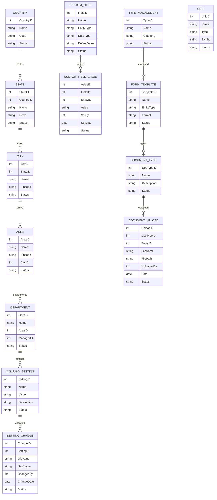

# Module 17: Settings Management – Entity Design (Based on Module Wise Features.txt SRS)

## 1. Master Entities

| Entity Name     | Description                       | Suggested Fields                                         |
|-----------------|-----------------------------------|---------------------------------------------------------|
| Country         | Country master                    | CountryID, Name, Code, Status                           |
| State           | State master                      | StateID, CountryID, Name, Code, Status                  |
| City            | City master                       | CityID, StateID, Name, Pincode, Status                  |
| Unit            | Measuring Unit master             | UnitID, Name, Type, Symbol, Status                      |
| Department      | Department master                 | DeptID, Name, AreaID, ManagerID, Status                 |
| Area            | Area master                       | AreaID, Name, Pincode, CityID, Status                   |
| DocumentType    | Document type master              | DocTypeID, Name, Description, Status                    |
| CustomField     | Custom field definition           | FieldID, Name, EntityType, DataType, DefaultValue, Status|
| CompanySetting  | Company setting master            | SettingID, Name, Value, Description, Status             |
| TypeManagement  | Type management (Leave, Service, etc.) | TypeID, Name, Category, Status                        |
| FormTemplate    | Form template master              | TemplateID, Name, EntityType, Format, Status            |

## 2. Transaction Entities

| Entity Name     | Description                       | Suggested Fields                                         |
|-----------------|-----------------------------------|---------------------------------------------------------|
| SettingChange   | Change log for settings           | ChangeID, SettingID, OldValue, NewValue, ChangedBy, ChangeDate, Status |
| DocumentUpload  | Document upload record            | UploadID, DocTypeID, EntityID, FileName, FilePath, UploadedBy, Date, Status |
| CustomFieldValue| Custom field value for entity     | ValueID, FieldID, EntityID, Value, SetBy, SetDate, Status|

## 3. Relations/Dependencies

- **State** references **Country**
- **City** references **State**
- **Area** references **City**
- **Department** references **Area**
- **DocumentUpload** references **DocumentType**, any entity via **EntityID**
- **CustomFieldValue** references **CustomField**, any entity via **EntityID**
- **SettingChange** references **CompanySetting**

---

## 4. Mermaid ER Diagram

