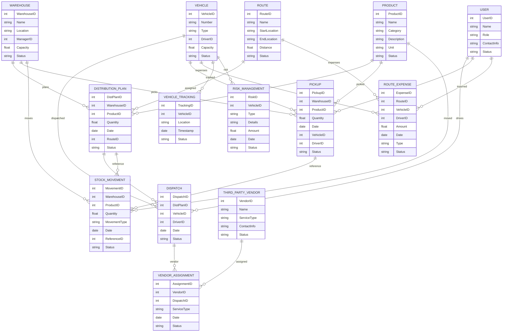

# Module 4: Supply Chain Management – Entity Design (Based on Module Wise Features.txt)

## 1. Master Entities

| Entity Name     | Description                         | Suggested Fields                                           |
|-----------------|-------------------------------------|-----------------------------------------------------------|
| Warehouse       | Warehouse master                    | WarehouseID, Name, Location, ManagerID, Capacity, Status  |
| Vehicle         | Vehicle tracking/management         | VehicleID, Number, Type, DriverID, Capacity, Status       |
| Route           | Route plan master                   | RouteID, Name, StartLocation, EndLocation, Distance, Status|
| User            | Supply chain/logistics users        | UserID, Name, Role, ContactInfo, Status                   |
| ThirdPartyVendor| External logistics/transport vendors| VendorID, Name, ServiceType, ContactInfo, Status          |

## 2. Transaction Entities

| Entity Name     | Description                         | Suggested Fields                                           |
|-----------------|-------------------------------------|-----------------------------------------------------------|
| DistributionPlan| Distribution plan for goods         | DistPlanID, WarehouseID, ProductID, Quantity, Date, RouteID, Status |
| Dispatch        | Dispatch of goods                   | DispatchID, DistPlanID, VehicleID, DriverID, Date, Status |
| Pickup          | Pickup of goods                     | PickupID, WarehouseID, ProductID, Quantity, Date, VehicleID, DriverID, Status |
| StockMovement   | Inward/outward stock movements      | MovementID, WarehouseID, ProductID, Quantity, MovementType, Date, ReferenceID, Status |
| RouteExpense    | Driver/vehicle route expenses       | ExpenseID, RouteID, VehicleID, DriverID, Amount, Date, Type, Status |
| VehicleTracking | Vehicle tracking/integration        | TrackingID, VehicleID, Location, Timestamp, Status        |
| RiskManagement  | Risk, insurance, fines management   | RiskID, VehicleID, Type, Details, Amount, Date, Status    |
| VendorAssignment| Third party vendor assignment       | AssignmentID, VendorID, DispatchID, ServiceType, Date, Status |

## 3. Relations/Dependencies

- **DistributionPlan** references **Warehouse**, **Product**, **Route**
- **Dispatch** references **DistributionPlan**, **Vehicle**, **User** (Driver)
- **Pickup** references **Warehouse**, **Product**, **Vehicle**, **User** (Driver)
- **StockMovement** references **Warehouse**, **Product**, and can reference **Dispatch** or **Pickup**
- **RouteExpense** references **Route**, **Vehicle**, **User**
- **VehicleTracking** references **Vehicle**
- **RiskManagement** references **Vehicle**
- **VendorAssignment** references **ThirdPartyVendor**, **Dispatch**

---

## 4. Mermaid ER Diagram

