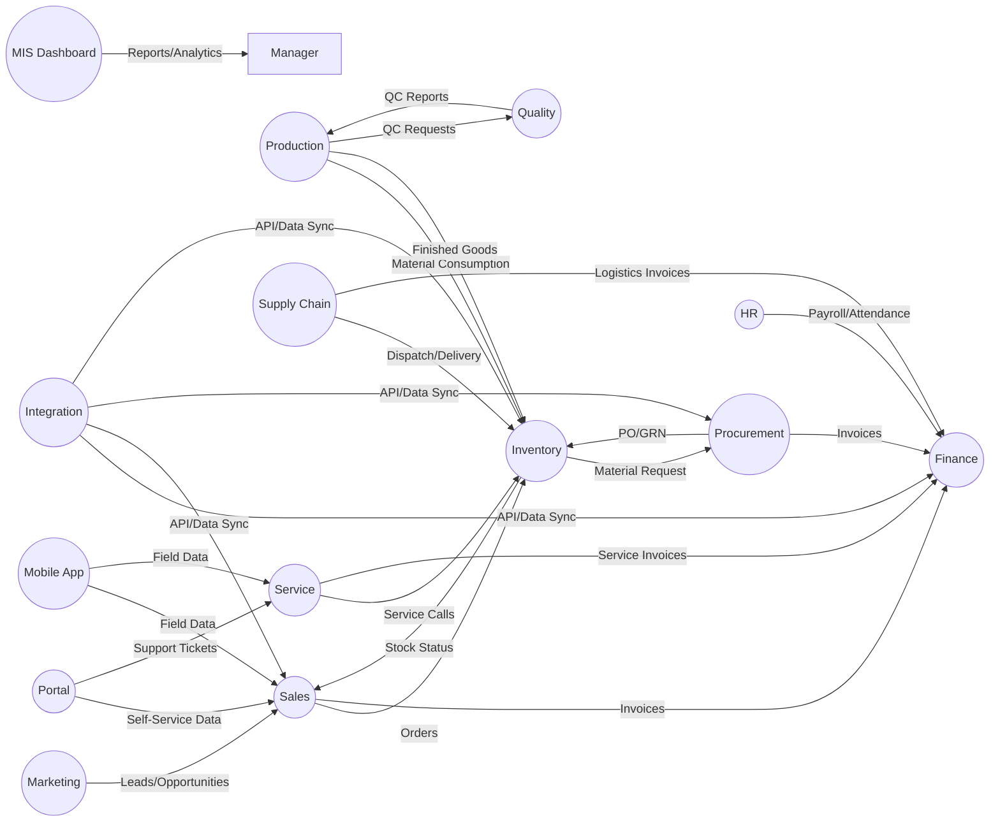

```mermaid
flowchart LR
    MarketingMgmt((Marketing))
    SalesMgmt((Sales))
    InventoryMgmt((Inventory))
    ProcurementMgmt((Procurement))
    ProductionMgmt((Production))
    QualityMgmt((Quality))
    ServiceMgmt((Service))
    FinanceMgmt((Finance))
    HRMgmt((HR))
    SCMgmt((Supply Chain))
    MISDashboard((MIS Dashboard))
    Integration((Integration))
    Portal((Portal))
    MobileApp((Mobile App))

    MarketingMgmt -->|Leads/Opportunities| SalesMgmt
    SalesMgmt -->|Orders| InventoryMgmt
    SalesMgmt -->|Invoices| FinanceMgmt
    InventoryMgmt -->|Stock Status| SalesMgmt
    InventoryMgmt -->|Material Request| ProcurementMgmt
    ProcurementMgmt -->|PO/GRN| InventoryMgmt
    ProcurementMgmt -->|Invoices| FinanceMgmt
    ProductionMgmt -->|Material Consumption| InventoryMgmt
    ProductionMgmt -->|Finished Goods| InventoryMgmt
    ProductionMgmt -->|QC Requests| QualityMgmt
    QualityMgmt -->|QC Reports| ProductionMgmt
    ServiceMgmt -->|Service Calls| InventoryMgmt
    ServiceMgmt -->|Service Invoices| FinanceMgmt
    HRMgmt -->|Payroll/Attendance| FinanceMgmt
    SCMgmt -->|Dispatch/Delivery| InventoryMgmt
    SCMgmt -->|Logistics Invoices| FinanceMgmt
    Portal -->|Self-Service Data| SalesMgmt
    Portal -->|Support Tickets| ServiceMgmt
    MobileApp -->|Field Data| SalesMgmt
    MobileApp -->|Field Data| ServiceMgmt
    Integration -->|API/Data Sync| FinanceMgmt
    Integration -->|API/Data Sync| SalesMgmt
    Integration -->|API/Data Sync| ProcurementMgmt
    Integration -->|API/Data Sync| InventoryMgmt
    MISDashboard -->|Reports/Analytics| Manager
```
