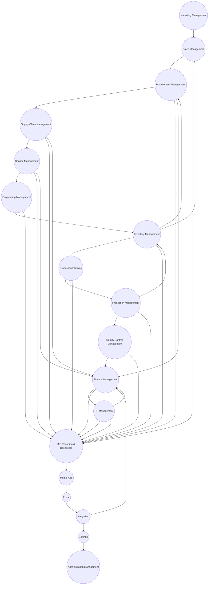

```mermaid
flowchart TD
    MarketingMgmt((Marketing Management))
    SalesMgmt((Sales Management))
    ProcurementMgmt((Procurement Management))
    SCMgmt((Supply Chain Management))
    ServiceMgmt((Service Management))
    EngineeringMgmt((Engineering Management))
    InventoryMgmt((Inventory Management))
    ProdPlanning((Production Planning))
    ProductionMgmt((Production Management))
    QualityMgmt((Quality Control Management))
    FinanceMgmt((Finance Management))
    HRMgmt((HR Management))
    MISDashboard((MIS Reporting & Dashboard))
    MobileApp((Mobile App))
    Portal((Portal))
    Integration((Integration))
    SettingsMgmt((Settings))
    AdminMgmt((Administration Management))

    MarketingMgmt --> SalesMgmt
    SalesMgmt --> ProcurementMgmt
    ProcurementMgmt --> SCMgmt
    SCMgmt --> ServiceMgmt
    ServiceMgmt --> EngineeringMgmt
    EngineeringMgmt --> InventoryMgmt
    InventoryMgmt --> ProdPlanning
    ProdPlanning --> ProductionMgmt
    ProductionMgmt --> QualityMgmt
    QualityMgmt --> FinanceMgmt
    FinanceMgmt --> HRMgmt
    HRMgmt --> MISDashboard
    MISDashboard --> MobileApp
    MobileApp --> Portal
    Portal --> Integration
    Integration --> SettingsMgmt
    SettingsMgmt --> AdminMgmt

    %% Feedback & reporting loops
    SalesMgmt --> MISDashboard
    ProcurementMgmt --> MISDashboard
    SCMgmt --> MISDashboard
    ServiceMgmt --> MISDashboard
    EngineeringMgmt --> MISDashboard
    InventoryMgmt --> MISDashboard
    ProdPlanning --> MISDashboard
    ProductionMgmt --> MISDashboard
    QualityMgmt --> MISDashboard
    FinanceMgmt --> MISDashboard
    HRMgmt --> MISDashboard

    %% Key cross-links
    InventoryMgmt --> SalesMgmt
    InventoryMgmt --> ProcurementMgmt
    ProductionMgmt --> InventoryMgmt
    ProcurementMgmt --> FinanceMgmt
    SCMgmt --> FinanceMgmt
    ServiceMgmt --> FinanceMgmt
    HRMgmt --> FinanceMgmt
    Integration --> FinanceMgmt
```
