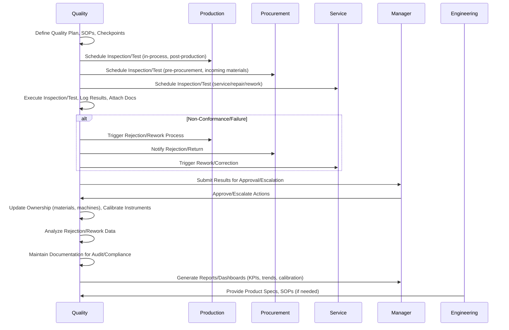

````markdown

```mermaid
%% Quality Control Management - Swimlane
%% Roles: Quality Controller, Production, Procurement, Service, Manager, Engineering

sequenceDiagram
    participant Quality
    participant Production
    participant Procurement
    participant Service
    participant Manager
    participant Engineering

    Quality->>Quality: Define Quality Plan, SOPs, Checkpoints
    Quality->>Production: Schedule Inspection/Test (in-process, post-production)
    Quality->>Procurement: Schedule Inspection/Test (pre-procurement, incoming materials)
    Quality->>Service: Schedule Inspection/Test (service/repair/rework)
    Quality->>Quality: Execute Inspection/Test, Log Results, Attach Docs
    alt Non-Conformance/Failure
        Quality->>Production: Trigger Rejection/Rework Process
        Quality->>Procurement: Notify Rejection/Return
        Quality->>Service: Trigger Rework/Correction
    end
    Quality->>Manager: Submit Results for Approval/Escalation
    Manager->>Quality: Approve/Escalate Actions
    Quality->>Quality: Update Ownership (materials, machines), Calibrate Instruments
    Quality->>Quality: Analyze Rejection/Rework Data
    Quality->>Quality: Maintain Documentation for Audit/Compliance
    Quality->>Manager: Generate Reports/Dashboards (KPIs, trends, calibration)
    Engineering->>Quality: Provide Product Specs, SOPs (if needed)
```
````