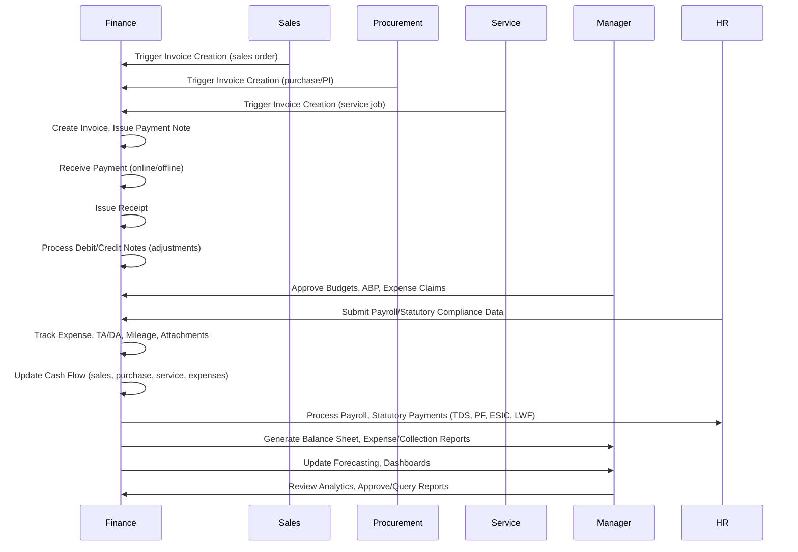

````markdown

```mermaid
%% Finance Management - Swimlane
%% Roles: Finance, Sales, Procurement, Service, Manager, HR

sequenceDiagram
    participant Finance
    participant Sales
    participant Procurement
    participant Service
    participant Manager
    participant HR

    Sales->>Finance: Trigger Invoice Creation (sales order)
    Procurement->>Finance: Trigger Invoice Creation (purchase/PI)
    Service->>Finance: Trigger Invoice Creation (service job)
    Finance->>Finance: Create Invoice, Issue Payment Note

    Finance->>Finance: Receive Payment (online/offline)
    Finance->>Finance: Issue Receipt
    Finance->>Finance: Process Debit/Credit Notes (adjustments)

    Manager->>Finance: Approve Budgets, ABP, Expense Claims
    HR->>Finance: Submit Payroll/Statutory Compliance Data
    Finance->>Finance: Track Expense, TA/DA, Mileage, Attachments

    Finance->>Finance: Update Cash Flow (sales, purchase, service, expenses)
    Finance->>HR: Process Payroll, Statutory Payments (TDS, PF, ESIC, LWF)

    Finance->>Manager: Generate Balance Sheet, Expense/Collection Reports
    Finance->>Manager: Update Forecasting, Dashboards
    Manager->>Finance: Review Analytics, Approve/Query Reports
```
````