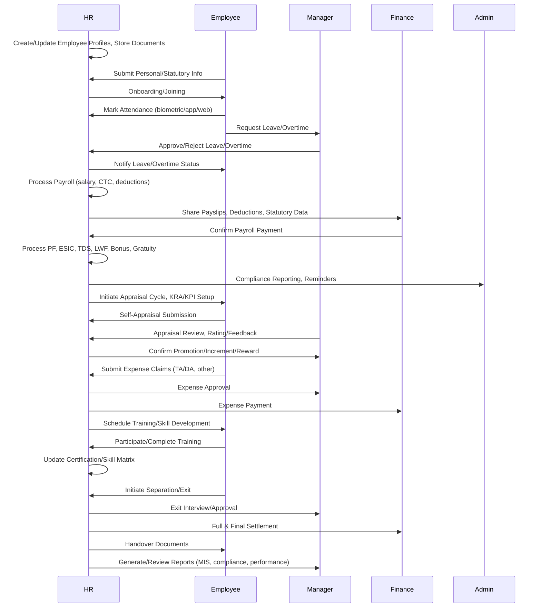

````markdown

```mermaid
%% HR Management - Swimlane
%% Roles: HR, Employee, Manager, Finance, Admin

sequenceDiagram
    participant HR
    participant Employee
    participant Manager
    participant Finance
    participant Admin

    HR->>HR: Create/Update Employee Profiles, Store Documents
    Employee->>HR: Submit Personal/Statutory Info
    HR->>Employee: Onboarding/Joining

    Employee->>HR: Mark Attendance (biometric/app/web)
    Employee->>Manager: Request Leave/Overtime
    Manager->>HR: Approve/Reject Leave/Overtime
    HR->>Employee: Notify Leave/Overtime Status

    HR->>HR: Process Payroll (salary, CTC, deductions)
    HR->>Finance: Share Payslips, Deductions, Statutory Data
    Finance->>HR: Confirm Payroll Payment

    HR->>HR: Process PF, ESIC, TDS, LWF, Bonus, Gratuity
    HR->>Admin: Compliance Reporting, Reminders

    HR->>Employee: Initiate Appraisal Cycle, KRA/KPI Setup
    Employee->>HR: Self-Appraisal Submission
    Manager->>HR: Appraisal Review, Rating/Feedback
    HR->>Manager: Confirm Promotion/Increment/Reward

    Employee->>HR: Submit Expense Claims (TA/DA, other)
    HR->>Manager: Expense Approval
    HR->>Finance: Expense Payment

    HR->>Employee: Schedule Training/Skill Development
    Employee->>HR: Participate/Complete Training
    HR->>HR: Update Certification/Skill Matrix

    Employee->>HR: Initiate Separation/Exit
    HR->>Manager: Exit Interview/Approval
    HR->>Finance: Full & Final Settlement
    HR->>Employee: Handover Documents

    HR->>Manager: Generate/Review Reports (MIS, compliance, performance)
```
````