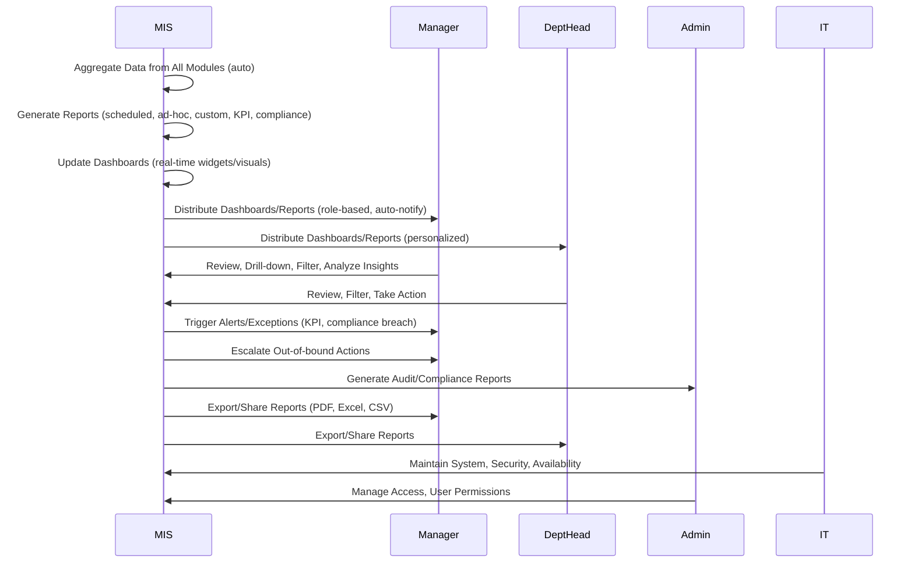

````markdown

```mermaid
%% MIS Reporting & Dashboard - Swimlane
%% Roles: MIS Analyst, Manager, Department Head, Admin, IT

sequenceDiagram
    participant MIS
    participant Manager
    participant DeptHead
    participant Admin
    participant IT

    MIS->>MIS: Aggregate Data from All Modules (auto)
    MIS->>MIS: Generate Reports (scheduled, ad-hoc, custom, KPI, compliance)
    MIS->>MIS: Update Dashboards (real-time widgets/visuals)

    MIS->>Manager: Distribute Dashboards/Reports (role-based, auto-notify)
    MIS->>DeptHead: Distribute Dashboards/Reports (personalized)
    Manager->>MIS: Review, Drill-down, Filter, Analyze Insights
    DeptHead->>MIS: Review, Filter, Take Action

    MIS->>Manager: Trigger Alerts/Exceptions (KPI, compliance breach)
    MIS->>Manager: Escalate Out-of-bound Actions
    MIS->>Admin: Generate Audit/Compliance Reports

    MIS->>Manager: Export/Share Reports (PDF, Excel, CSV)
    MIS->>DeptHead: Export/Share Reports

    IT->>MIS: Maintain System, Security, Availability
    Admin->>MIS: Manage Access, User Permissions
```
````