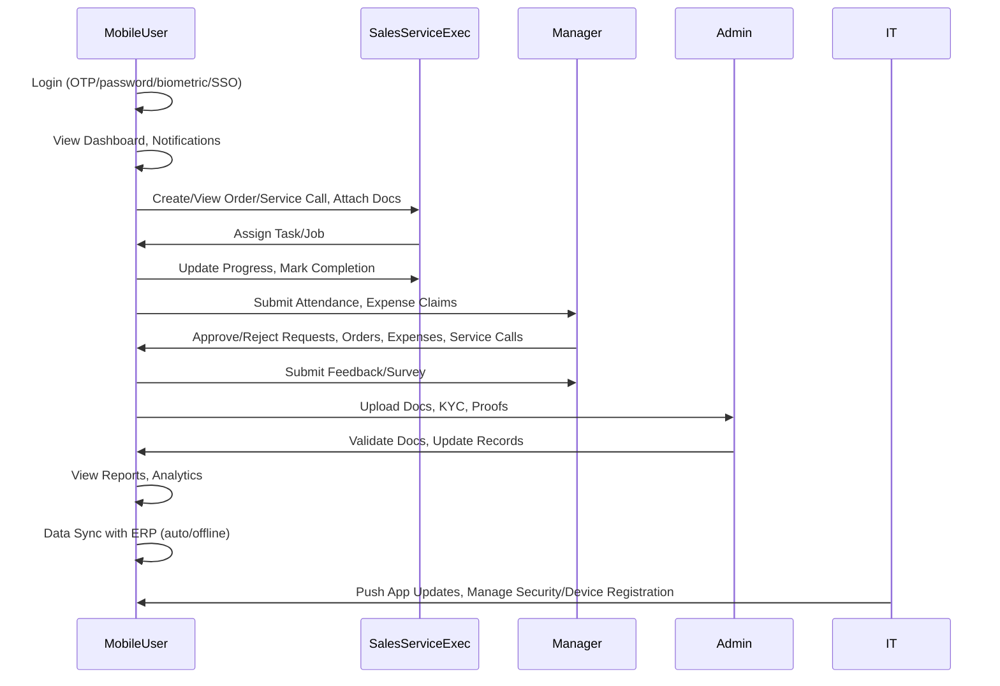

````markdown

```mermaid
%% Mobile App - Swimlane
%% Roles: Mobile User, Sales/Service Executive, Manager, Admin, IT

sequenceDiagram
    participant MobileUser
    participant SalesServiceExec
    participant Manager
    participant Admin
    participant IT

    MobileUser->>MobileUser: Login (OTP/password/biometric/SSO)
    MobileUser->>MobileUser: View Dashboard, Notifications
    MobileUser->>SalesServiceExec: Create/View Order/Service Call, Attach Docs
    SalesServiceExec->>MobileUser: Assign Task/Job
    MobileUser->>SalesServiceExec: Update Progress, Mark Completion
    MobileUser->>Manager: Submit Attendance, Expense Claims
    Manager->>MobileUser: Approve/Reject Requests, Orders, Expenses, Service Calls
    MobileUser->>Manager: Submit Feedback/Survey
    MobileUser->>Admin: Upload Docs, KYC, Proofs
    Admin->>MobileUser: Validate Docs, Update Records
    MobileUser->>MobileUser: View Reports, Analytics
    MobileUser->>MobileUser: Data Sync with ERP (auto/offline)
    IT->>MobileUser: Push App Updates, Manage Security/Device Registration
```
````