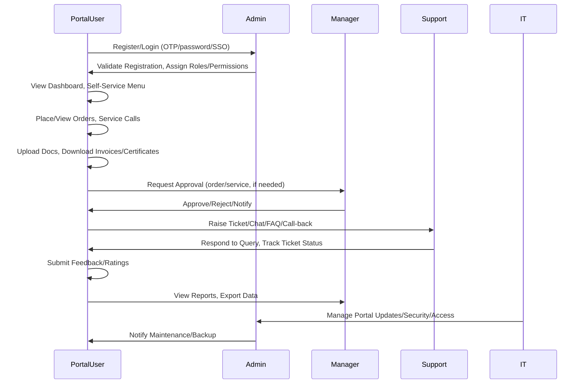

````markdown

```mermaid
%% Portal - Swimlane
%% Roles: Portal User, Admin, Manager, Support, IT

sequenceDiagram
    participant PortalUser
    participant Admin
    participant Manager
    participant Support
    participant IT

    PortalUser->>Admin: Register/Login (OTP/password/SSO)
    Admin->>PortalUser: Validate Registration, Assign Roles/Permissions
    PortalUser->>PortalUser: View Dashboard, Self-Service Menu
    PortalUser->>PortalUser: Place/View Orders, Service Calls
    PortalUser->>PortalUser: Upload Docs, Download Invoices/Certificates

    PortalUser->>Manager: Request Approval (order/service, if needed)
    Manager->>PortalUser: Approve/Reject/Notify

    PortalUser->>Support: Raise Ticket/Chat/FAQ/Call-back
    Support->>PortalUser: Respond to Query, Track Ticket Status

    PortalUser->>PortalUser: Submit Feedback/Ratings
    PortalUser->>Manager: View Reports, Export Data

    IT->>Admin: Manage Portal Updates/Security/Access
    Admin->>PortalUser: Notify Maintenance/Backup
```
````