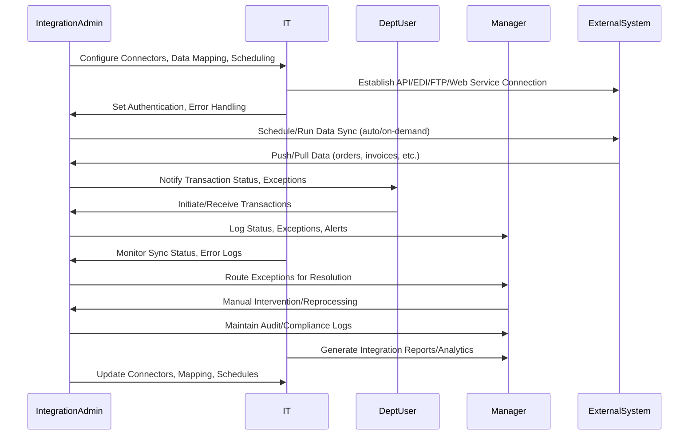

````markdown

```mermaid
%% Integration - Swimlane
%% Roles: Integration Admin, IT, Department User, Manager, External System

sequenceDiagram
    participant IntegrationAdmin
    participant IT
    participant DeptUser
    participant Manager
    participant ExternalSystem

    IntegrationAdmin->>IT: Configure Connectors, Data Mapping, Scheduling
    IT->>ExternalSystem: Establish API/EDI/FTP/Web Service Connection
    IT->>IntegrationAdmin: Set Authentication, Error Handling

    IntegrationAdmin->>ExternalSystem: Schedule/Run Data Sync (auto/on-demand)
    ExternalSystem->>IntegrationAdmin: Push/Pull Data (orders, invoices, etc.)
    IntegrationAdmin->>DeptUser: Notify Transaction Status, Exceptions

    DeptUser->>IntegrationAdmin: Initiate/Receive Transactions
    IntegrationAdmin->>Manager: Log Status, Exceptions, Alerts

    IT->>IntegrationAdmin: Monitor Sync Status, Error Logs
    IntegrationAdmin->>Manager: Route Exceptions for Resolution
    Manager->>IntegrationAdmin: Manual Intervention/Reprocessing

    IntegrationAdmin->>Manager: Maintain Audit/Compliance Logs
    IT->>Manager: Generate Integration Reports/Analytics

    IntegrationAdmin->>IT: Update Connectors, Mapping, Schedules
```
````