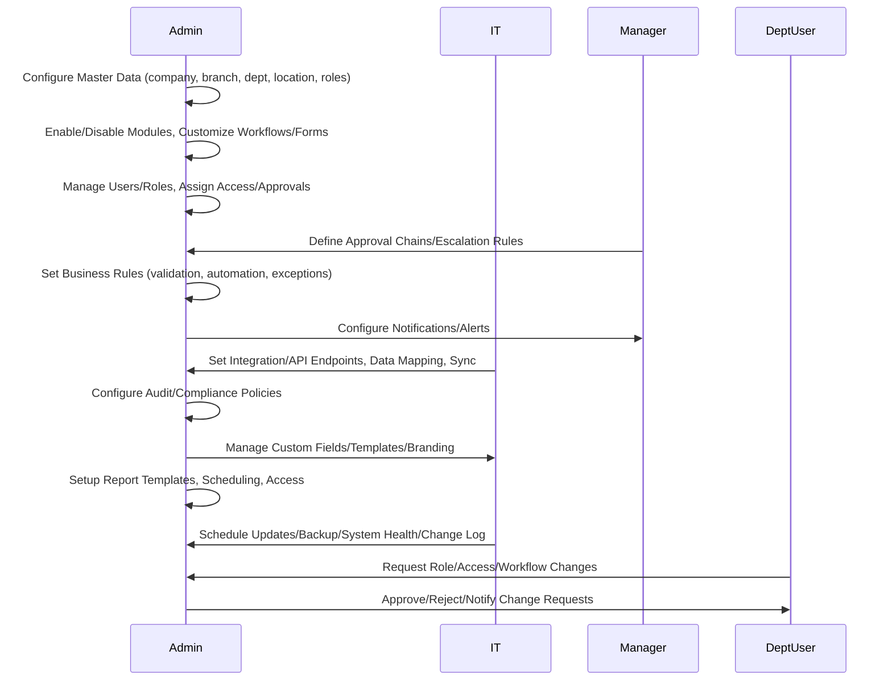

````markdown

```mermaid
%% Settings Management - Swimlane
%% Roles: Admin, IT, Manager, Department User

sequenceDiagram
    participant Admin
    participant IT
    participant Manager
    participant DeptUser

    Admin->>Admin: Configure Master Data (company, branch, dept, location, roles)
    Admin->>Admin: Enable/Disable Modules, Customize Workflows/Forms
    Admin->>Admin: Manage Users/Roles, Assign Access/Approvals
    Manager->>Admin: Define Approval Chains/Escalation Rules
    Admin->>Admin: Set Business Rules (validation, automation, exceptions)
    Admin->>Manager: Configure Notifications/Alerts

    IT->>Admin: Set Integration/API Endpoints, Data Mapping, Sync
    Admin->>Admin: Configure Audit/Compliance Policies
    Admin->>IT: Manage Custom Fields/Templates/Branding
    Admin->>Admin: Setup Report Templates, Scheduling, Access
    IT->>Admin: Schedule Updates/Backup/System Health/Change Log

    DeptUser->>Admin: Request Role/Access/Workflow Changes
    Admin->>DeptUser: Approve/Reject/Notify Change Requests
```
````