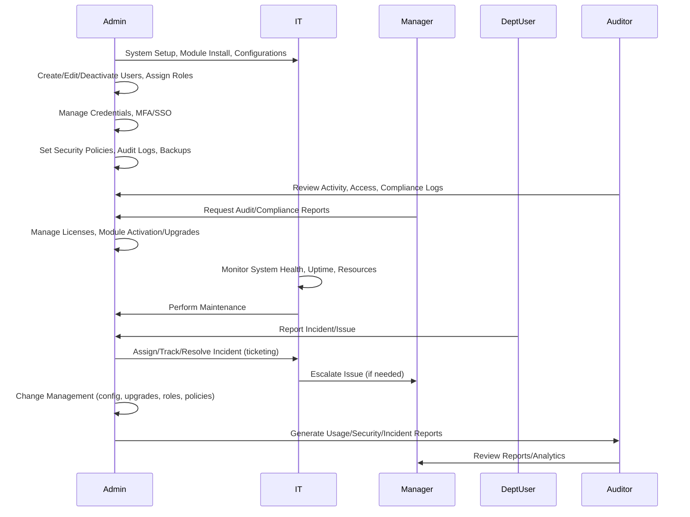

````markdown

```mermaid
%% Administration Management - Swimlane
%% Roles: System Admin, IT, Manager, Department User, Auditor

sequenceDiagram
    participant Admin
    participant IT
    participant Manager
    participant DeptUser
    participant Auditor

    Admin->>IT: System Setup, Module Install, Configurations
    Admin->>Admin: Create/Edit/Deactivate Users, Assign Roles
    Admin->>Admin: Manage Credentials, MFA/SSO
    Admin->>Admin: Set Security Policies, Audit Logs, Backups

    Auditor->>Admin: Review Activity, Access, Compliance Logs
    Manager->>Admin: Request Audit/Compliance Reports

    Admin->>Admin: Manage Licenses, Module Activation/Upgrades
    IT->>IT: Monitor System Health, Uptime, Resources
    IT->>Admin: Perform Maintenance

    DeptUser->>Admin: Report Incident/Issue
    Admin->>IT: Assign/Track/Resolve Incident (ticketing)
    IT->>Manager: Escalate Issue (if needed)

    Admin->>Admin: Change Management (config, upgrades, roles, policies)
    Admin->>Auditor: Generate Usage/Security/Incident Reports
    Auditor->>Manager: Review Reports/Analytics
```
````