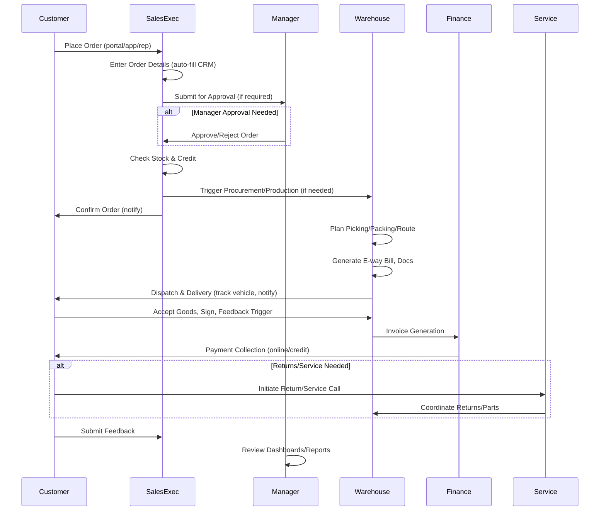

````markdown

```mermaid
%% Sales Management - Swimlane
%% Roles: Customer, Sales Executive, Manager, Warehouse, Finance, Service

sequenceDiagram
    participant Customer
    participant SalesExec
    participant Manager
    participant Warehouse
    participant Finance
    participant Service

    Customer->>SalesExec: Place Order (portal/app/rep)
    SalesExec->>SalesExec: Enter Order Details (auto-fill CRM)
    SalesExec->>Manager: Submit for Approval (if required)
    alt Manager Approval Needed
        Manager->>SalesExec: Approve/Reject Order
    end
    SalesExec->>SalesExec: Check Stock & Credit
    SalesExec->>Warehouse: Trigger Procurement/Production (if needed)
    SalesExec->>Customer: Confirm Order (notify)
    Warehouse->>Warehouse: Plan Picking/Packing/Route
    Warehouse->>Warehouse: Generate E-way Bill, Docs
    Warehouse->>Customer: Dispatch & Delivery (track vehicle, notify)
    Customer->>Warehouse: Accept Goods, Sign, Feedback Trigger

    Warehouse->>Finance: Invoice Generation
    Finance->>Customer: Payment Collection (online/credit)
    alt Returns/Service Needed
        Customer->>Service: Initiate Return/Service Call
        Service->>Warehouse: Coordinate Returns/Parts
    end
    Customer->>SalesExec: Submit Feedback
    Manager->>Manager: Review Dashboards/Reports
```
````