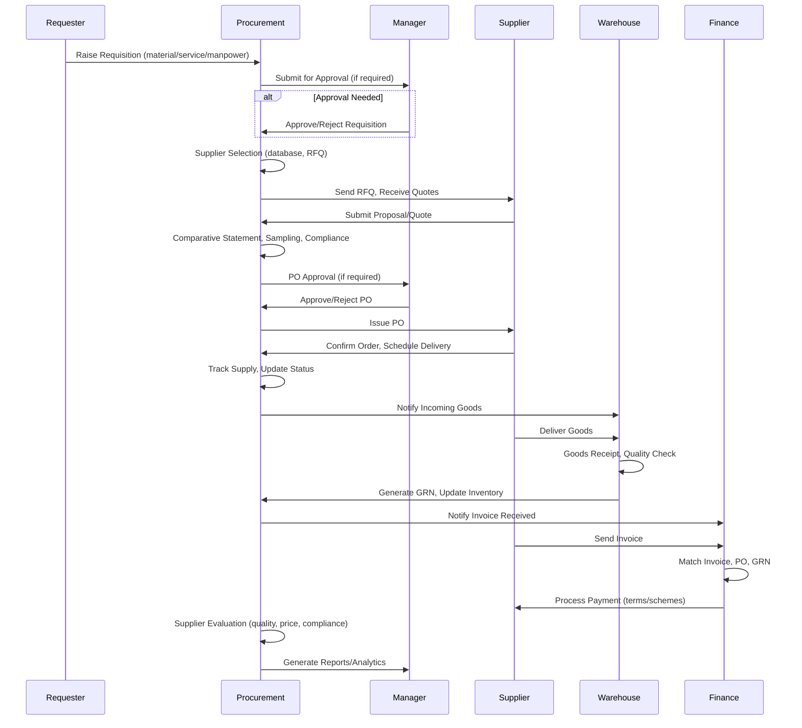

````markdown

```mermaid
%% Procurement Management - Swimlane
%% Roles: Requester, Procurement, Manager, Supplier, Warehouse, Finance

sequenceDiagram
    participant Requester
    participant Procurement
    participant Manager
    participant Supplier
    participant Warehouse
    participant Finance

    Requester->>Procurement: Raise Requisition (material/service/manpower)
    Procurement->>Manager: Submit for Approval (if required)
    alt Approval Needed
        Manager->>Procurement: Approve/Reject Requisition
    end
    Procurement->>Procurement: Supplier Selection (database, RFQ)
    Procurement->>Supplier: Send RFQ, Receive Quotes
    Supplier->>Procurement: Submit Proposal/Quote
    Procurement->>Procurement: Comparative Statement, Sampling, Compliance
    Procurement->>Manager: PO Approval (if required)
    Manager->>Procurement: Approve/Reject PO
    Procurement->>Supplier: Issue PO
    Supplier->>Procurement: Confirm Order, Schedule Delivery
    Procurement->>Procurement: Track Supply, Update Status
    Procurement->>Warehouse: Notify Incoming Goods
    Supplier->>Warehouse: Deliver Goods
    Warehouse->>Warehouse: Goods Receipt, Quality Check
    Warehouse->>Procurement: Generate GRN, Update Inventory
    Procurement->>Finance: Notify Invoice Received
    Supplier->>Finance: Send Invoice
    Finance->>Finance: Match Invoice, PO, GRN
    Finance->>Supplier: Process Payment (terms/schemes)
    Procurement->>Procurement: Supplier Evaluation (quality, price, compliance)
    Procurement->>Manager: Generate Reports/Analytics
```
````