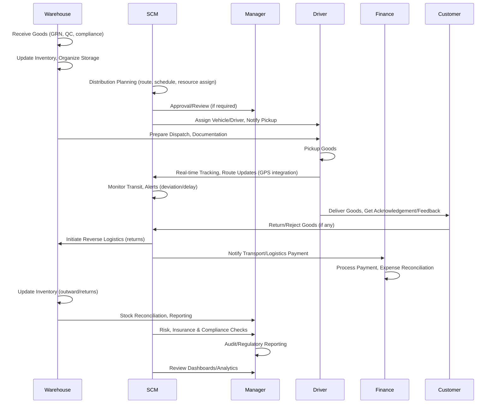

````markdown

```mermaid
%% Supply Chain Management - Swimlane
%% Roles: Warehouse, SCM/Logistics, Manager, Driver/Transporter, Finance, Customer

sequenceDiagram
    participant Warehouse
    participant SCM
    participant Manager
    participant Driver
    participant Finance
    participant Customer

    Warehouse->>Warehouse: Receive Goods (GRN, QC, compliance)
    Warehouse->>Warehouse: Update Inventory, Organize Storage

    SCM->>SCM: Distribution Planning (route, schedule, resource assign)
    SCM->>Manager: Approval/Review (if required)
    SCM->>Driver: Assign Vehicle/Driver, Notify Pickup

    Warehouse->>Driver: Prepare Dispatch, Documentation
    Driver->>Driver: Pickup Goods
    Driver->>SCM: Real-time Tracking, Route Updates (GPS integration)
    SCM->>SCM: Monitor Transit, Alerts (deviation/delay)
    
    Driver->>Customer: Deliver Goods, Get Acknowledgement/Feedback
    Customer->>SCM: Return/Reject Goods (if any)
    SCM->>Warehouse: Initiate Reverse Logistics (returns)

    SCM->>Finance: Notify Transport/Logistics Payment
    Finance->>Finance: Process Payment, Expense Reconciliation

    Warehouse->>Warehouse: Update Inventory (outward/returns)
    Warehouse->>Manager: Stock Reconciliation, Reporting

    SCM->>Manager: Risk, Insurance & Compliance Checks
    Manager->>Manager: Audit/Regulatory Reporting

    SCM->>Manager: Review Dashboards/Analytics
```
````