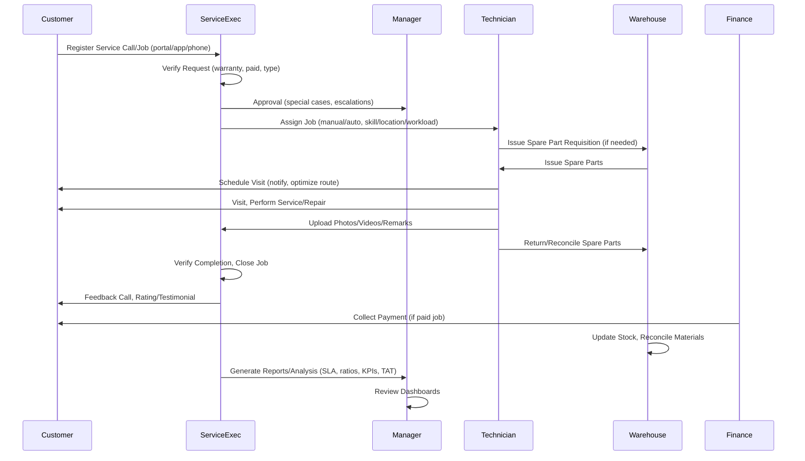

````markdown

```mermaid
%% Service Management - Swimlane
%% Roles: Customer, Service Executive, Manager, Technician, Warehouse, Finance

sequenceDiagram
    participant Customer
    participant ServiceExec
    participant Manager
    participant Technician
    participant Warehouse
    participant Finance

    Customer->>ServiceExec: Register Service Call/Job (portal/app/phone)
    ServiceExec->>ServiceExec: Verify Request (warranty, paid, type)
    ServiceExec->>Manager: Approval (special cases, escalations)
    ServiceExec->>Technician: Assign Job (manual/auto, skill/location/workload)
    Technician->>Warehouse: Issue Spare Part Requisition (if needed)
    Warehouse->>Technician: Issue Spare Parts
    Technician->>Customer: Schedule Visit (notify, optimize route)
    Technician->>Customer: Visit, Perform Service/Repair
    Technician->>ServiceExec: Upload Photos/Videos/Remarks
    Technician->>Warehouse: Return/Reconcile Spare Parts

    ServiceExec->>ServiceExec: Verify Completion, Close Job
    ServiceExec->>Customer: Feedback Call, Rating/Testimonial
    Finance->>Customer: Collect Payment (if paid job)
    Warehouse->>Warehouse: Update Stock, Reconcile Materials

    ServiceExec->>Manager: Generate Reports/Analysis (SLA, ratios, KPIs, TAT)
    Manager->>Manager: Review Dashboards
```
````