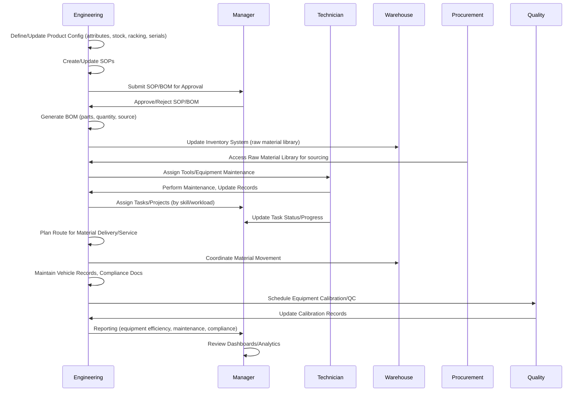

````markdown

```mermaid
%% Engineering Management - Swimlane
%% Roles: Engineering, Manager, Technician, Warehouse, Procurement, Quality

sequenceDiagram
    participant Engineering
    participant Manager
    participant Technician
    participant Warehouse
    participant Procurement
    participant Quality

    Engineering->>Engineering: Define/Update Product Config (attributes, stock, racking, serials)
    Engineering->>Engineering: Create/Update SOPs
    Engineering->>Manager: Submit SOP/BOM for Approval
    Manager->>Engineering: Approve/Reject SOP/BOM

    Engineering->>Engineering: Generate BOM (parts, quantity, source)
    Engineering->>Warehouse: Update Inventory System (raw material library)
    Procurement->>Engineering: Access Raw Material Library for sourcing
    Engineering->>Technician: Assign Tools/Equipment Maintenance
    Technician->>Engineering: Perform Maintenance, Update Records
    Engineering->>Manager: Assign Tasks/Projects (by skill/workload)
    Technician->>Manager: Update Task Status/Progress

    Engineering->>Engineering: Plan Route for Material Delivery/Service
    Engineering->>Warehouse: Coordinate Material Movement
    Engineering->>Engineering: Maintain Vehicle Records, Compliance Docs
    Engineering->>Quality: Schedule Equipment Calibration/QC
    Quality->>Engineering: Update Calibration Records

    Engineering->>Manager: Reporting (equipment efficiency, maintenance, compliance)
    Manager->>Manager: Review Dashboards/Analytics
```
````