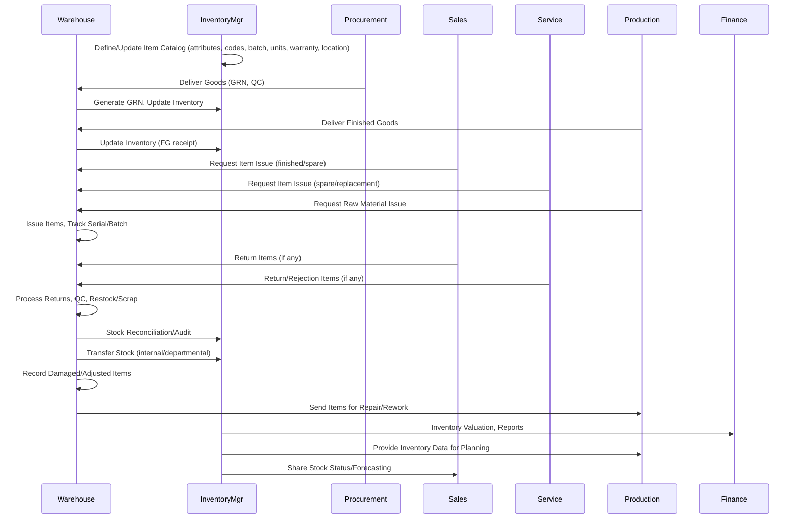

````markdown

```mermaid
%% Inventory Management - Swimlane
%% Roles: Warehouse, Inventory Manager, Procurement, Sales, Service, Production, Finance

sequenceDiagram
    participant Warehouse
    participant InventoryMgr
    participant Procurement
    participant Sales
    participant Service
    participant Production
    participant Finance

    InventoryMgr->>InventoryMgr: Define/Update Item Catalog (attributes, codes, batch, units, warranty, location)
    Procurement->>Warehouse: Deliver Goods (GRN, QC)
    Warehouse->>InventoryMgr: Generate GRN, Update Inventory
    Production->>Warehouse: Deliver Finished Goods
    Warehouse->>InventoryMgr: Update Inventory (FG receipt)

    Sales->>Warehouse: Request Item Issue (finished/spare)
    Service->>Warehouse: Request Item Issue (spare/replacement)
    Production->>Warehouse: Request Raw Material Issue
    Warehouse->>Warehouse: Issue Items, Track Serial/Batch

    Sales->>Warehouse: Return Items (if any)
    Service->>Warehouse: Return/Rejection Items (if any)
    Warehouse->>Warehouse: Process Returns, QC, Restock/Scrap

    Warehouse->>InventoryMgr: Stock Reconciliation/Audit
    Warehouse->>InventoryMgr: Transfer Stock (internal/departmental)

    Warehouse->>Warehouse: Record Damaged/Adjusted Items
    Warehouse->>Production: Send Items for Repair/Rework

    InventoryMgr->>Finance: Inventory Valuation, Reports
    InventoryMgr->>Production: Provide Inventory Data for Planning
    InventoryMgr->>Sales: Share Stock Status/Forecasting
```
````