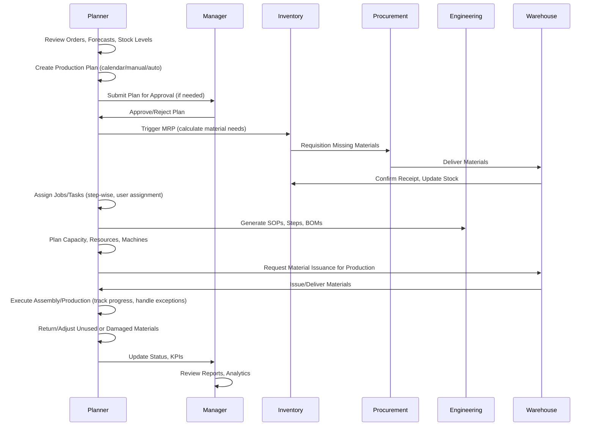

````markdown

```mermaid
%% Production Planning Management - Swimlane
%% Roles: Production Planner, Manager, Inventory, Procurement, Engineering, Warehouse

sequenceDiagram
    participant Planner
    participant Manager
    participant Inventory
    participant Procurement
    participant Engineering
    participant Warehouse

    Planner->>Planner: Review Orders, Forecasts, Stock Levels
    Planner->>Planner: Create Production Plan (calendar/manual/auto)
    Planner->>Manager: Submit Plan for Approval (if needed)
    Manager->>Planner: Approve/Reject Plan

    Planner->>Inventory: Trigger MRP (calculate material needs)
    Inventory->>Procurement: Requisition Missing Materials
    Procurement->>Warehouse: Deliver Materials
    Warehouse->>Inventory: Confirm Receipt, Update Stock

    Planner->>Planner: Assign Jobs/Tasks (step-wise, user assignment)
    Planner->>Engineering: Generate SOPs, Steps, BOMs
    Planner->>Planner: Plan Capacity, Resources, Machines

    Planner->>Warehouse: Request Material Issuance for Production
    Warehouse->>Planner: Issue/Deliver Materials

    Planner->>Planner: Execute Assembly/Production (track progress, handle exceptions)
    Planner->>Planner: Return/Adjust Unused or Damaged Materials
    Planner->>Manager: Update Status, KPIs
    Manager->>Manager: Review Reports, Analytics
```
````