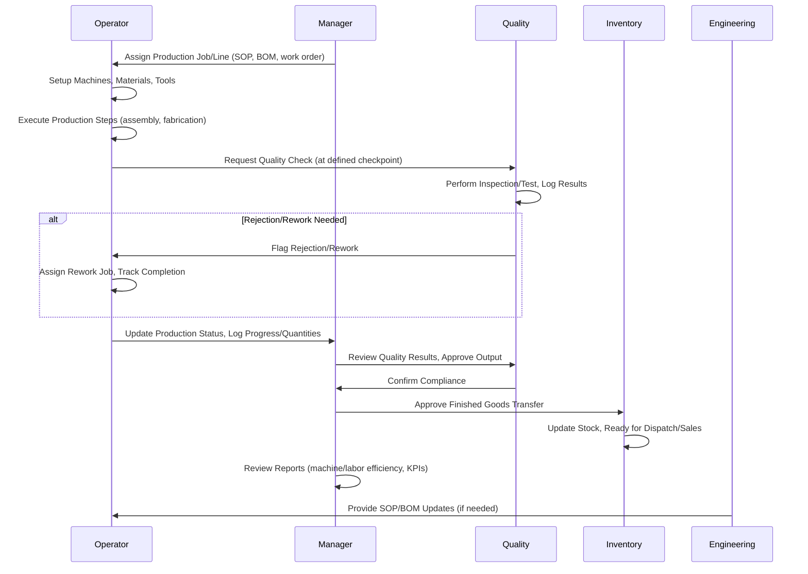

````markdown

```mermaid
%% Production Management - Swimlane
%% Roles: Production Operator, Production Manager, Quality, Inventory/Warehouse, Engineering

sequenceDiagram
    participant Operator
    participant Manager
    participant Quality
    participant Inventory
    participant Engineering

    Manager->>Operator: Assign Production Job/Line (SOP, BOM, work order)
    Operator->>Operator: Setup Machines, Materials, Tools
    Operator->>Operator: Execute Production Steps (assembly, fabrication)
    Operator->>Quality: Request Quality Check (at defined checkpoint)
    Quality->>Quality: Perform Inspection/Test, Log Results
    alt Rejection/Rework Needed
        Quality->>Operator: Flag Rejection/Rework
        Operator->>Operator: Assign Rework Job, Track Completion
    end
    Operator->>Manager: Update Production Status, Log Progress/Quantities
    Manager->>Quality: Review Quality Results, Approve Output
    Quality->>Manager: Confirm Compliance
    Manager->>Inventory: Approve Finished Goods Transfer
    Inventory->>Inventory: Update Stock, Ready for Dispatch/Sales
    Manager->>Manager: Review Reports (machine/labor efficiency, KPIs)
    Engineering->>Operator: Provide SOP/BOM Updates (if needed)
```
````