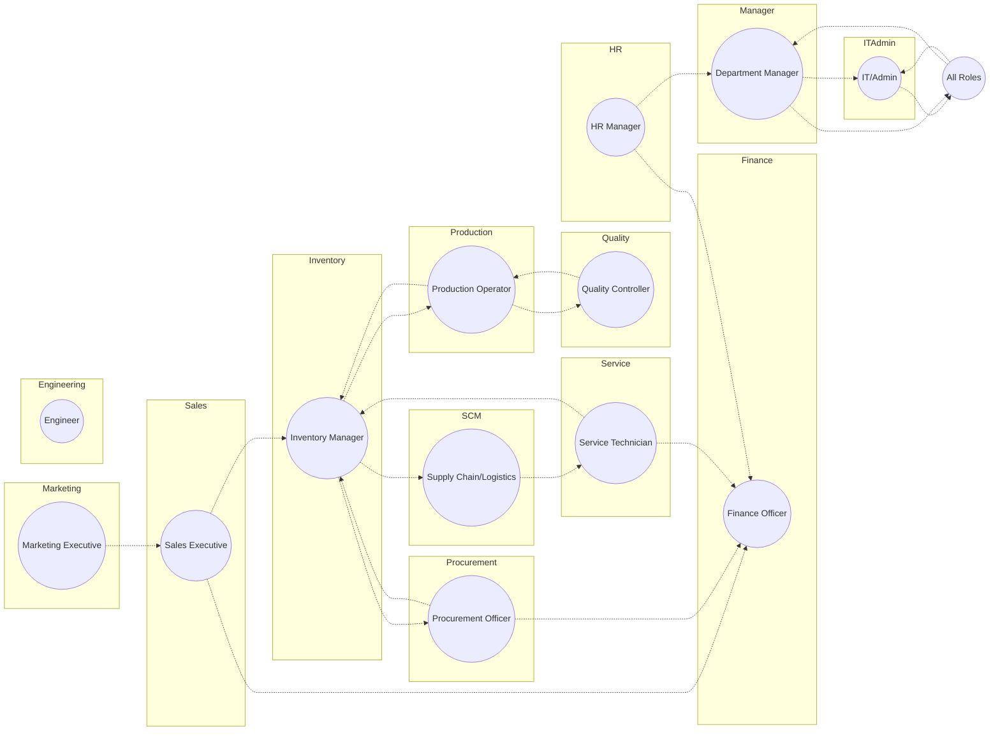

```mermaid
%% Swimlane overlay: Major roles across modules
%% Roles: Marketing, Sales, Procurement, SCM, Service, Engineering, Inventory, Production, Quality, Finance, HR, Manager, IT/Admin

flowchart LR
    subgraph Marketing
        MarketingUser((Marketing Executive))
    end
    subgraph Sales
        SalesUser((Sales Executive))
    end
    subgraph Procurement
        ProcurementUser((Procurement Officer))
    end
    subgraph SCM
        SCMUser((Supply Chain/Logistics))
    end
    subgraph Service
        ServiceUser((Service Technician))
    end
    subgraph Engineering
        EngineeringUser((Engineer))
    end
    subgraph Inventory
        InventoryUser((Inventory Manager))
    end
    subgraph Production
        ProductionUser((Production Operator))
    end
    subgraph Quality
        QualityUser((Quality Controller))
    end
    subgraph Finance
        FinanceUser((Finance Officer))
    end
    subgraph HR
        HRUser((HR Manager))
    end
    subgraph Manager
        ManagerUser((Department Manager))
    end
    subgraph ITAdmin
        ITAdminUser((IT/Admin))
    end

    MarketingUser -.-> SalesUser
    SalesUser -.-> InventoryUser
    SalesUser -.-> FinanceUser
    InventoryUser -.-> ProcurementUser
    ProcurementUser -.-> InventoryUser
    ProcurementUser -.-> FinanceUser
    InventoryUser -.-> ProductionUser
    ProductionUser -.-> QualityUser
    QualityUser -.-> ProductionUser
    ProductionUser -.-> InventoryUser
    InventoryUser -.-> SCMUser
    SCMUser -.-> ServiceUser
    ServiceUser -.-> InventoryUser
    ServiceUser -.-> FinanceUser
    HRUser -.-> FinanceUser
    HRUser -.-> ManagerUser
    ManagerUser -.-> ITAdminUser
    ITAdminUser -.-> AllRoles
    ManagerUser -.-> AllRoles

    %% Feedback loop
    AllRoles((All Roles))
    AllRoles -.-> ManagerUser
    AllRoles -.-> ITAdminUser
```
